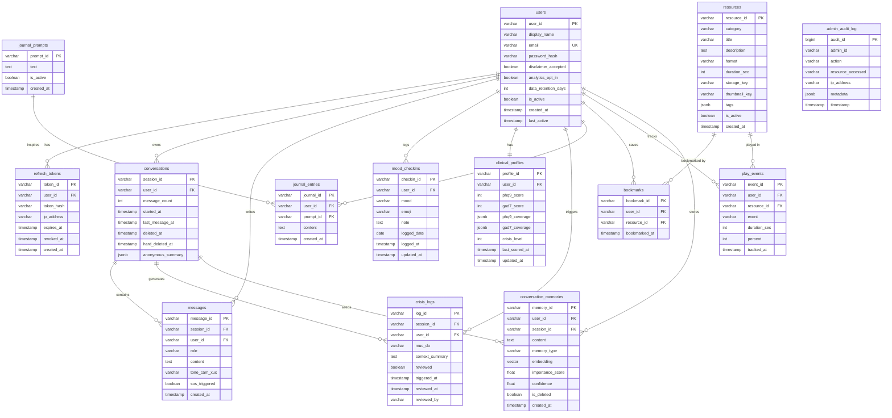

# DB Schema — Serene Mental Health App

**Stack:** PostgreSQL 15 + pgvector extension  
**Ngày:** 2026-04-12 | **Phiên bản:** 1.0 (còn tối ưu nữa)

---

## 1. ER Diagram



---

## 2. Danh sách Tables

### 2.1 `users` — Tài khoản người dùng

| Field | Type | Constraint | Mô tả |
|---|---|---|---|
| `user_id` | VARCHAR(50) | PK | Hashed ID, không bao giờ là email |
| `display_name` | VARCHAR(255) | NOT NULL | Tên hiển thị |
| `email` | VARCHAR(255) | UNIQUE NOT NULL | Email đăng nhập |
| `password_hash` | VARCHAR(255) | NOT NULL | bcrypt hash |
| `disclaimer_accepted` | BOOLEAN | DEFAULT FALSE | Bắt buộc tick khi signup |
| `analytics_opt_in` | BOOLEAN | DEFAULT FALSE | Quyền dùng data cho analytics |
| `data_retention_days` | INTEGER | DEFAULT 90 | Số ngày giữ dữ liệu |
| `is_active` | BOOLEAN | DEFAULT TRUE | Soft disable account |
| `created_at` | TIMESTAMP | DEFAULT NOW() | |
| `last_active` | TIMESTAMP | DEFAULT NOW() | Cập nhật mỗi lần request |

---

### 2.2 `refresh_tokens` — Auth token store

| Field | Type | Constraint | Mô tả |
|---|---|---|---|
| `token_id` | VARCHAR(50) | PK | |
| `user_id` | VARCHAR(50) | FK → users | |
| `token_hash` | VARCHAR(255) | NOT NULL | SHA-256 của refresh token thực |
| `ip_address` | VARCHAR(45) | | IP khi issued |
| `expires_at` | TIMESTAMP | NOT NULL | TTL 30 ngày |
| `revoked_at` | TIMESTAMP | NULLABLE | Set khi logout |
| `created_at` | TIMESTAMP | DEFAULT NOW() | |

> Token thực lưu trong httpOnly cookie. DB chỉ lưu hash để validate và revoke.

---

### 2.3 `conversations` — Phiên chat

| Field | Type | Constraint | Mô tả |
|---|---|---|---|
| `session_id` | VARCHAR(50) | PK | |
| `user_id` | VARCHAR(50) | FK → users | |
| `message_count` | INTEGER | DEFAULT 0 | Cập nhật mỗi lượt chat |
| `started_at` | TIMESTAMP | DEFAULT NOW() | |
| `last_message_at` | TIMESTAMP | DEFAULT NOW() | |
| `deleted_at` | TIMESTAMP | NULLABLE | Soft delete |
| `hard_deleted_at` | TIMESTAMP | NULLABLE | GDPR hard delete |
| `anonymous_summary` | JSONB | NULLABLE | Giữ 90 ngày sau soft delete — chỉ chứa thống kê ẩn danh (số turn, tone), không có nội dung |

---

### 2.4 `messages` — Tin nhắn

| Field | Type | Constraint | Mô tả |
|---|---|---|---|
| `message_id` | VARCHAR(50) | PK | |
| `session_id` | VARCHAR(50) | FK → conversations | |
| `user_id` | VARCHAR(50) | FK → users | Dư thừa nhưng tối ưu query |
| `role` | VARCHAR(20) | CHECK IN ('user','assistant') | |
| `content` | TEXT | NOT NULL, MAX 2000 chars | PII-masked trước khi lưu |
| `tone_cam_xuc` | VARCHAR(20) | NULLABLE | ho_tro / xac_nhan / vui_tuoi / lam_diu |
| `sos_triggered` | BOOLEAN | DEFAULT FALSE | True nếu tin nhắn này kích hoạt SOS |
| `created_at` | TIMESTAMP | DEFAULT NOW() | |

---

### 2.5 `mood_checkins` — Mood hàng ngày

| Field | Type | Constraint | Mô tả |
|---|---|---|---|
| `checkin_id` | VARCHAR(50) | PK | |
| `user_id` | VARCHAR(50) | FK → users | |
| `mood` | VARCHAR(50) | NOT NULL | peaceful / melancholic / radiant / restless / stressed / okay |
| `emoji` | VARCHAR(10) | NULLABLE | |
| `note` | TEXT | NULLABLE | Ghi chú tự do |
| `logged_date` | DATE | NOT NULL | Ngày theo UTC+7 — unique per user |
| `logged_at` | TIMESTAMP | DEFAULT NOW() | |
| `updated_at` | TIMESTAMP | NULLABLE | Set khi PATCH |

> UNIQUE constraint: `(user_id, logged_date)` — enforce 1 checkin/ngày.

---

### 2.6 `clinical_profiles` — Điểm lâm sàng tích lũy

| Field | Type | Constraint | Mô tả |
|---|---|---|---|
| `profile_id` | VARCHAR(50) | PK | |
| `user_id` | VARCHAR(50) | FK → users, UNIQUE | 1 profile per user |
| `phq9_score` | INTEGER | NULLABLE, 0–27 | Tính bởi Analyst agent ngầm |
| `gad7_score` | INTEGER | NULLABLE, 0–21 | |
| `phq9_coverage` | JSONB | DEFAULT '{}' | Câu nào đã được ánh xạ |
| `gad7_coverage` | JSONB | DEFAULT '{}' | |
| `crisis_level` | INTEGER | DEFAULT 0, 0–5 | muc_do_khung_hoang hiện tại |
| `last_scored_at` | TIMESTAMP | NULLABLE | |
| `updated_at` | TIMESTAMP | DEFAULT NOW() | |

> Không bao giờ expose score thô ra FE user — chỉ dùng nội bộ và B2B dashboard.

---

### 2.7 `crisis_logs` — Sự kiện SOS

| Field | Type | Constraint | Mô tả |
|---|---|---|---|
| `log_id` | VARCHAR(50) | PK | |
| `session_id` | VARCHAR(50) | FK → conversations | |
| `user_id` | VARCHAR(50) | FK → users | Hashed, không PII |
| `muc_do` | VARCHAR(20) | NOT NULL | vua / cao / tuc_thoi |
| `context_summary` | TEXT | NULLABLE | Tóm tắt ẩn danh, không raw content |
| `reviewed` | BOOLEAN | DEFAULT FALSE | Admin đã review chưa |
| `triggered_at` | TIMESTAMP | DEFAULT NOW() | |
| `reviewed_at` | TIMESTAMP | NULLABLE | |
| `reviewed_by` | VARCHAR(50) | NULLABLE | admin_id |

---

### 2.8 `journal_entries` — Nhật ký

| Field | Type | Constraint | Mô tả |
|---|---|---|---|
| `journal_id` | VARCHAR(50) | PK | |
| `user_id` | VARCHAR(50) | FK → users | |
| `prompt_id` | VARCHAR(50) | FK → journal_prompts, NULLABLE | Null nếu tự viết |
| `content` | TEXT | NOT NULL, MAX 10000 chars | |
| `created_at` | TIMESTAMP | DEFAULT NOW() | |

---

### 2.9 `journal_prompts` — Gợi ý viết journal

| Field | Type | Constraint | Mô tả |
|---|---|---|---|
| `prompt_id` | VARCHAR(50) | PK | |
| `text` | TEXT | NOT NULL | Nội dung gợi ý |
| `is_active` | BOOLEAN | DEFAULT TRUE | |
| `created_at` | TIMESTAMP | DEFAULT NOW() | |

---

### 2.10 `resources` — Thư viện nội dung

| Field | Type | Constraint | Mô tả |
|---|---|---|---|
| `resource_id` | VARCHAR(50) | PK | |
| `category` | VARCHAR(50) | NOT NULL | meditate / sleep / music / work_study / wisdom / movement |
| `title` | VARCHAR(255) | NOT NULL | |
| `description` | TEXT | NULLABLE | |
| `format` | VARCHAR(20) | NOT NULL | audio / video / article |
| `duration_sec` | INTEGER | NOT NULL | |
| `storage_key` | VARCHAR(500) | NOT NULL | CDN object key (không phải full URL — presign khi serve) |
| `thumbnail_key` | VARCHAR(500) | NULLABLE | |
| `tags` | JSONB | DEFAULT '[]' | |
| `is_active` | BOOLEAN | DEFAULT TRUE | |
| `created_at` | TIMESTAMP | DEFAULT NOW() | |

---

### 2.11 `bookmarks` — Nội dung đã lưu

| Field | Type | Constraint | Mô tả |
|---|---|---|---|
| `bookmark_id` | VARCHAR(50) | PK | |
| `user_id` | VARCHAR(50) | FK → users | |
| `resource_id` | VARCHAR(50) | FK → resources | |
| `bookmarked_at` | TIMESTAMP | DEFAULT NOW() | |

> UNIQUE constraint: `(user_id, resource_id)`.

---

### 2.12 `play_events` — Tracking nghe/xem

| Field | Type | Constraint | Mô tả |
|---|---|---|---|
| `event_id` | VARCHAR(50) | PK | |
| `user_id` | VARCHAR(50) | FK → users | |
| `resource_id` | VARCHAR(50) | FK → resources | |
| `event` | VARCHAR(20) | CHECK IN ('started','paused','completed') | |
| `duration_sec` | INTEGER | NOT NULL, ≥ 0 | Thực tế nghe bao lâu |
| `percent` | INTEGER | CHECK 0–100 | % hoàn thành |
| `tracked_at` | TIMESTAMP | DEFAULT NOW() | |

---

### 2.13 `conversation_memories` — Long-term memory (pgvector)

| Field | Type | Constraint | Mô tả |
|---|---|---|---|
| `memory_id` | VARCHAR(50) | PK | |
| `user_id` | VARCHAR(50) | FK → users | |
| `session_id` | VARCHAR(50) | FK → conversations, NULLABLE | |
| `content` | TEXT | NOT NULL | Event summary đã PII-masked |
| `memory_type` | VARCHAR(50) | | emotion / preference / fact / topic / goal |
| `embedding` | vector(1536) | NOT NULL | text-embedding-3-small |
| `importance_score` | FLOAT | 0.0–1.0 | |
| `confidence` | FLOAT | 0.0–1.0 | |
| `is_deleted` | BOOLEAN | DEFAULT FALSE | |
| `created_at` | TIMESTAMP | DEFAULT NOW() | |

> Row-Level Security bật — mỗi user chỉ đọc được memory của chính mình.

---

### 2.14 `admin_audit_log` — Audit trail admin

| Field | Type | Constraint | Mô tả |
|---|---|---|---|
| `audit_id` | BIGSERIAL | PK | Auto-increment |
| `admin_id` | VARCHAR(50) | NOT NULL | |
| `action` | VARCHAR(100) | NOT NULL | GET_CRISIS_LOGS / GET_DASHBOARD / etc. |
| `resource_accessed` | VARCHAR(255) | | Endpoint + params |
| `ip_address` | VARCHAR(45) | NOT NULL | |
| `metadata` | JSONB | DEFAULT '{}' | |
| `timestamp` | TIMESTAMP | DEFAULT NOW() | |

> Append-only — không có UPDATE/DELETE trên bảng này.

---

## 3. Data Pipeline

```
Nguồn dữ liệu                   Cách thu thập            Lưu vào
─────────────────────────────────────────────────────────────────
User messages (chat)        →   REST POST /chat/message  →  messages + conversation_memories
Mood daily check-in         →   POST /mood/checkin       →  mood_checkins
Journal entries             →   POST /reflect/journal    →  journal_entries
Resource play tracking      →   POST /play-event         →  play_events
Clinical scores (implicit)  →   Analyst agent (async)    →  clinical_profiles
Crisis events               →   SOS rule-based (sync)    →  crisis_logs
Admin actions               →   Middleware hook           →  admin_audit_log
Resources (seed data)       →   Manual / curated CSV     →  resources + journal_prompts
```

**Dữ liệu thật không cần ở Gate 2** — xem Mock Data ở mục 4.

---

## 4. Mock Data

### users

| user_id | display_name | email | disclaimer_accepted | created_at |
|---|---|---|---|---|
| `usr_a1b2c3d4e5` | Minh Anh | `minh.anh@example.com` | TRUE | 2026-04-01T08:00:00Z |
| `usr_f6g7h8i9j0` | Tiến Đạt | `tien.dat@example.com` | TRUE | 2026-04-03T14:22:00Z |

---

### mood_checkins

| checkin_id | user_id | mood | emoji | note | logged_date |
|---|---|---|---|---|---|
| `mc_001` | `usr_a1b2c3d4e5` | stressed | 😮‍💨 | Deadline đồ án dồn hết tuần này | 2026-04-10 |
| `mc_002` | `usr_a1b2c3d4e5` | okay | 😐 | Nộp xong rồi, nhẹ hơn | 2026-04-11 |
| `mc_003` | `usr_f6g7h8i9j0` | melancholic | 😔 | Không rõ tại sao buồn | 2026-04-10 |

---

### conversations

| session_id | user_id | message_count | started_at |
|---|---|---|---|
| `sess_xyz001` | `usr_a1b2c3d4e5` | 8 | 2026-04-10T23:00:00Z |
| `sess_xyz002` | `usr_f6g7h8i9j0` | 4 | 2026-04-11T01:15:00Z |

---

### messages

| message_id | session_id | role | content | tone_cam_xuc | sos_triggered |
|---|---|---|---|---|---|
| `msg_001` | `sess_xyz001` | user | Cảm thấy hơi bất lực vì bài tập quá nhiều... | NULL | FALSE |
| `msg_002` | `sess_xyz001` | assistant | Nghe có vẻ bạn đang gồng gánh nhiều thứ một lúc. Áp lực kiểu này mệt lắm... | xac_nhan | FALSE |
| `msg_003` | `sess_xyz001` | user | Mình không muốn tiếp tục nữa | NULL | FALSE |
| `msg_004` | `sess_xyz001` | assistant | NULL | NULL | TRUE |

---

### clinical_profiles

| profile_id | user_id | phq9_score | gad7_score | crisis_level | last_scored_at |
|---|---|---|---|---|---|
| `cp_001` | `usr_a1b2c3d4e5` | 11 | 8 | 1 | 2026-04-10T23:15:00Z |
| `cp_002` | `usr_f6g7h8i9j0` | NULL | NULL | 0 | NULL |

---

### crisis_logs

| log_id | session_id | muc_do | reviewed | triggered_at |
|---|---|---|---|---|
| `cl_001` | `sess_xyz001` | cao | FALSE | 2026-04-10T23:22:00Z |

---

### resources

| resource_id | category | title | format | duration_sec | storage_key |
|---|---|---|---|---|---|
| `res_001` | meditate | Thiền cho người lo âu | audio | 600 | `audio/meditate/anxiety_10min.mp3` |
| `res_002` | sleep | The Midnight Woods | audio | 1800 | `audio/sleep/midnight_woods.mp3` |
| `res_003` | meditate | Thở 4-7-8 | audio | 180 | `audio/breath/478_breathing.mp3` |
| `res_004` | wisdom | Nhận diện suy nghĩ tiêu cực | article | 300 | `article/cbt/negative_thoughts.md` |

---

### journal_prompts

| prompt_id | text |
|---|---|
| `prompt_01` | Hôm nay điều gì khiến bạn cảm thấy tự hào về bản thân? |
| `prompt_02` | Điều gì đang chiếm nhiều năng lượng nhất của bạn tuần này? |
| `prompt_03` | Nếu nói chuyện với bản thân 1 năm trước, bạn sẽ nói gì? |

---

### conversation_memories

| memory_id | user_id | memory_type | content | importance_score |
|---|---|---|---|---|
| `mem_001` | `usr_a1b2c3d4e5` | emotion | [PERSON] đang cảm thấy áp lực về deadline cuối tuần | 0.85 |
| `mem_002` | `usr_a1b2c3d4e5` | fact | [PERSON] hay thức khuya sau 23h khi bị stress | 0.72 |

---

## 5. Indexes & Constraints tóm tắt

```sql
-- Enforce 1 mood checkin per user per day (UTC+7)
ALTER TABLE mood_checkins ADD CONSTRAINT uq_mood_per_day UNIQUE (user_id, logged_date);

-- 1 clinical profile per user
ALTER TABLE clinical_profiles ADD CONSTRAINT uq_clinical_user UNIQUE (user_id);

-- No duplicate bookmarks
ALTER TABLE bookmarks ADD CONSTRAINT uq_bookmark UNIQUE (user_id, resource_id);

-- pgvector HNSW index for fast ANN search
CREATE INDEX idx_memory_embedding ON conversation_memories
    USING hnsw (embedding vector_cosine_ops)
    WHERE is_deleted = FALSE;

-- Row-Level Security on memories
ALTER TABLE conversation_memories ENABLE ROW LEVEL SECURITY;
CREATE POLICY rls_memory_isolation ON conversation_memories
    USING (user_id = current_setting('app.current_user_id')::text);

-- Admin audit log: append-only (revoke DELETE privilege)
REVOKE DELETE ON admin_audit_log FROM app_user;
```
