## Thông tin dự án
- **Tên cụ thể**: Multi-Agent Therapist Sàng Lọc và Hỗ Trợ Sức Khỏe Tinh Thần
- **Stack**: React.js + FastAPI + LangGraph + PostgreSQL + pgvector
- **Ngày**: 2026-04-12
- **Phiên bản**: 1.0

---

## Mục lục

1. [Landing Page — Public](#1-landing-page--public)
2. [Auth Flow — Đăng nhập / Đăng ký](#2-auth-flow--đăng-nhập--đăng-ký)
3. [Onboarding — Disclaimer AI](#3-onboarding--disclaimer-ai)
4. [Home — Mood Picker & Dashboard](#4-home--mood-picker--dashboard)
5. [Chat — Peer Listener (Agent Friend)](#5-chat--peer-listener-agent-friend)
6. [SOS — Crisis Guardrail](#6-sos--crisis-guardrail)
7. [Reflect — Wellness Summary](#7-reflect--wellness-summary)
8. [Resources — Content Library](#8-resources--content-library)
9. [Connect — Hotline & Map](#9-connect--hotline--map)
10. [Breath — Bài tập thở](#10-breath--bài-tập-thở)
11. [Settings — Cài đặt](#11-settings--cài-đặt)
12. [Admin — B2B Technical Dashboard](#12-admin--b2b-technical-dashboard)

---

## 1. Landing Page — Public

> **Mục đích:** Trang chào đón công khai, không cần đăng nhập. Thiết lập cảm xúc bình yên, giảm stigma, dẫn dắt người dùng vào onboarding.
> **Kết nối kiến trúc:** Không gọi LLM. Static content + CTA dẫn đến Auth Flow.

### 1.1 Hero Section — Desktop

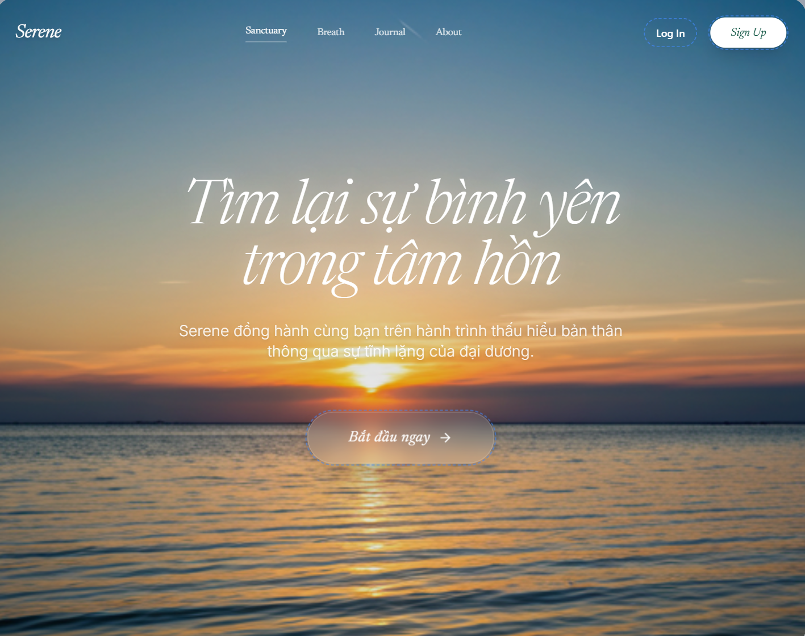

**Mô tả:** Hero full-viewport với ảnh nền hoàng hôn đại dương. Navbar trắng gồm: *Sanctuary · Breath · Journal · About* + nút *Log In / Sign Up*. Headline italic serif lớn: *"Tìm lại sự bình yên trong tâm hồn"*. Sub-copy giới thiệu sứ mệnh Serene. CTA pill *"Bắt đầu ngay →"*.

**Điểm thiết kế quan trọng:**
- Font chữ serif italic để gợi sự ấm áp, phi lâm sàng — tránh cảm giác "app khám bệnh" (Pain Point: *Sự khô khan lâm sàng* từ MVP Canvas §3).
- Màu nền gradient tự nhiên (hoàng hôn biển) → thương hiệu "Digital Sanctuary".
- Navbar anchor links cuộn mượt đến các section bên dưới.

---

### 1.2 Hero Section — Responsive / Smaller Viewport

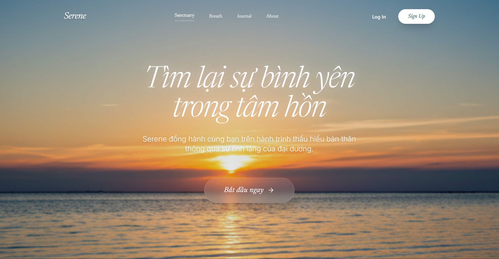

**Mô tả:** Phiên bản thu nhỏ của hero, navbar rút gọn label thành *Summary · Breath · Journal · About*. Layout tương tự nhưng font scale nhỏ hơn.

**Điểm thiết kế quan trọng:**
- Đảm bảo CTA vẫn hiển thị above-the-fold ở màn hình 1280px.
- Breakpoint responsive cần kiểm tra ở 1280px, 1440px, 1920px.

---

### 1.3 About Section — "Người bạn AI luôn lắng nghe"

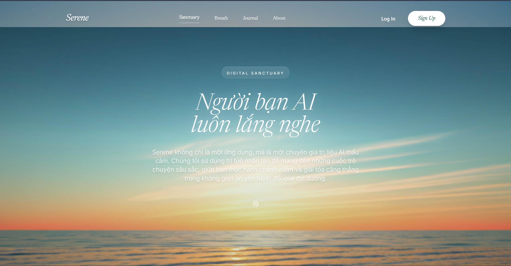

**Mô tả:** Section thứ hai của landing. Badge nhỏ *"DIGITAL SANCTUARY"*. Headline: *"Người bạn AI luôn lắng nghe"*. Body text mô tả cơ chế Peer-to-Peer ẩn danh, không phán xét. Icon scroll-down ở cuối.

**Kết nối tính năng:** Giải thích ngầm về **Invisible Clinical Layer** (PRD §1.2) — người dùng chỉ thấy "người bạn đồng hành", không biết có Analyst chạy ngầm.

---

### 1.4 Ocean Sounds Feature Section

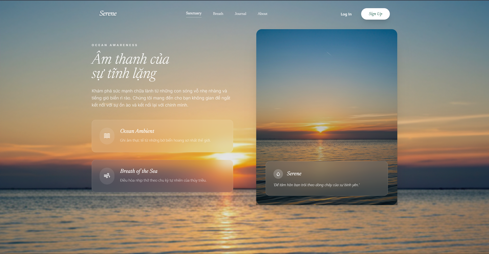

**Mô tả:** Section giới thiệu tính năng âm thanh thiền. Bên trái: headline *"Âm thanh của sự tĩnh lặng"* + mô tả + 2 item list (*Ocean Ambience*, *Breath of the Sea*). Bên phải: card preview audio player với ảnh thumbnail hoàng hôn và label *"Serene"*.

**Kết nối tính năng:** Teaser cho **Breath / Resources** tab — static audio library (ARCHITECTURE §VIII: *"Thiền 'Bắt đầu tập trung'" — Static từ Self-help library*).

---

## 2. Auth Flow — Đăng nhập / Đăng ký

> **Mục đích:** Xác thực người dùng tối giản, thu thập thông tin tối thiểu để giảm rào cản gia nhập.
> **Kết nối kiến trúc:** JWT Auth → FastAPI Gateway (ARCHITECTURE §II bước 1).

### 2.1 Login Page

**Mô tả:** Modal card trắng nổi trên nền ảnh hoàng hôn. Logo *"Serene"* serif + badge *"DIGITAL SANCTUARY"*. Form: Email + Mật khẩu (có toggle hiện/ẩn). CTA *"Bước vào"* màu xanh rừng đậm. Link *"Thêm gia nhập"*.

---

### 2.2 Login Page — Alternate State

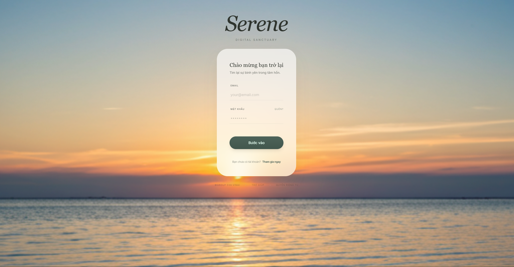

**Mô tả:** Cùng layout với 2.1, ảnh nền hoàng hôn đậm hơn (evening light). Dùng cho trạng thái khi user quay lại sau session trước.

---

### 2.3 Sign Up — "Bắt đầu hành trình"

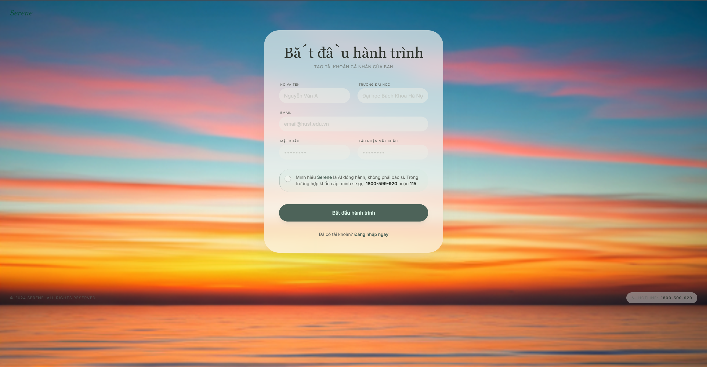

**Mô tả:** Form đăng ký đầy đủ hơn. Headline: *"Bắt đầu hành trình"*. Fields: Họ tên · Tên đăng nhập · Email · Mật khẩu · Tên trường · Mã sinh viên (optional). Checkbox disclaimer *"Mình hiểu Serene là AI đồng hành, không phải chuyên gia. Trong trường hợp khủng hoảng, gọi 1800-599-920 cấp TB."*. CTA *"Bắt đầu hành trình"*. Link đăng nhập.

**Điểm thiết kế quan trọng:**
- Trường *Tên trường* phục vụ **University Context RAG** (MVP Canvas §7 Agent 3) — định danh nguồn dữ liệu học vụ.
- Checkbox disclaimer là **bắt buộc** theo ARCHITECTURE §IX nguyên tắc 7: *"Disclaimer bắt buộc khi signup. User tick 'Serene là AI, không thay thế chuyên gia'"*.
- Hotline 1800-599-920 hiển thị ngay trong form signup — an toàn từ bước đầu tiên.

---

## 3. Onboarding — Disclaimer AI

> **Mục đích:** Màn hình bắt buộc sau signup lần đầu — thiết lập kỳ vọng đúng về giới hạn của AI.
> **Kết nối kiến trúc:** ARCHITECTURE §IX nguyên tắc 7 + Safety Recall Rate KPI.

### 3.1 Disclaimer Screen

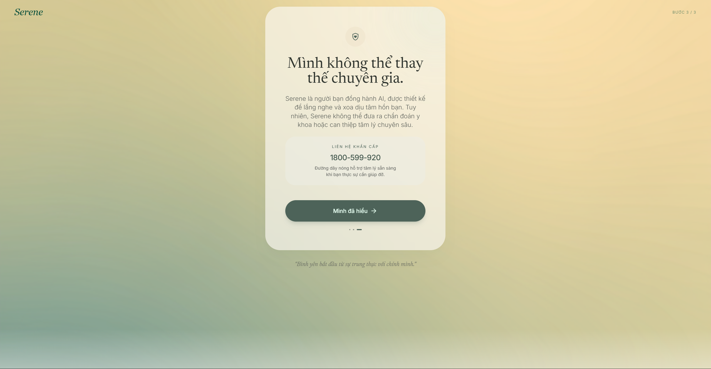

**Mô tả:** Màn hình nền gradient xanh-vàng nhẹ. Icon shield ở trên. Headline lớn serif: *"Mình không thể thay thế chuyên gia."* Body text giải thích rõ vai trò AI đồng hành, không thay thế can thiệp lâm sàng. Hiển thị nổi bật số hotline *1800-599-920*. CTA *"Mình đã hiểu →"*. Indicator pagination dots phía dưới (onboarding có thể multi-step).

**Điểm thiết kế quan trọng:**
- Không có nút skip — người dùng buộc phải đọc và xác nhận.
- Thiết kế ấm (gradient pastel) thay vì cảnh báo đỏ — duy trì cảm xúc an toàn, không gây lo lắng.

---

## 4. Home — Mood Picker & Dashboard

> **Mục đích:** Màn hình chính sau đăng nhập. Thu thập mood hàng ngày và hiển thị nội dung gợi ý cá nhân hóa.
> **Kết nối kiến trúc:** Mood input → Middleware ghi thẳng `lich_su_tam_trang` (ARCHITECTURE §VIII — *không gọi LLM*). User Journey §V bước 1 (buổi sáng).

### 4.1 Home — Mood Picker

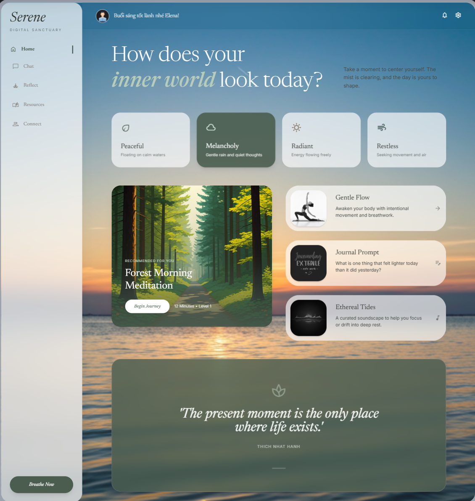

**Mô tả:** Layout sidebar trái (nav: Home · Chat · Reflect · Resources · Connect) + main content area. Headline: *"How does your inner world look today?"* Mood grid 4 ô: *Peaceful · Melancholic · Radiant · Restless* (mỗi ô có icon + label + sub-label mô tả). Bên phải: các content card — *Gentle Flow meditation video*, *Journal Prompts*, *Ethereal Tides audio*. Dưới cùng: *Quote of the day* + nút *Breathe Now*.

**Điểm thiết kế quan trọng:**
- Mood picker là **input đầu ngày** — dữ liệu ghi vào `lich_su_tam_trang[]` trong `TrangThaiSerene` (ARCHITECTURE §VI Schema State).
- 4 mood options được thiết kế phi lâm sàng (không dùng từ "depressed", "anxious") để tránh stigma.
- Content cards bên phải cá nhân hóa theo mood được chọn (logic phía backend).

---

## 5. Chat — Peer Listener (Agent Friend)

> **Mục đích:** Giao diện hội thoại chính với Agent Friend (Peer Listener). Đây là core feature — nơi diễn ra toàn bộ luồng đồng bộ và bất đồng bộ của multi-agent.
> **Kết nối kiến trúc:** ARCHITECTURE §II-III — Middleware PII Masking → Supervisor → Analyst (ngầm) → Friend → Output Guardrails → Chat UI.

### 5.1 Chat — Peer Listener với Suggestion Card

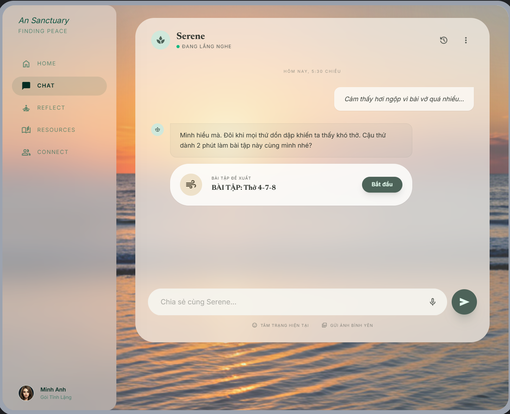

**Mô tả:** Layout 2 cột: sidebar nav trái + chat area phải. Header chat: avatar Serene tròn + tên *"Serene"* + badge *"đang lắng nghe"* + icon settings/more. Bubble người dùng (phải, nền xanh): *"Cảm thấy hơi bất lực vì bài tập quá nhiều..."*. Bubble Serene (trái, nền trắng): phản hồi thấu cảm bằng ngôn ngữ Gen Z + câu xác nhận cảm xúc. Card đính kèm màu xanh rừng: *"BÀI TẬP Thở 4-7-8 · Bắt đầu"*. Input bar: *"Chia sẻ cùng Serene..."* + icon mic + nút gửi.

**Điểm thiết kế quan trọng:**
- **Agent Friend** (GPT-4o, temp 0.7) tạo nội dung bubble + quick replies (PRD §2.1 — ngôn ngữ Gen Z, không dùng thuật ngữ y khoa).
- Card *"BÀI TẬP Thở 4-7-8"* là `TheUI` đính kèm trong `PhanHoiHoiThoai.the_dinh_kem[]` — output từ `hanh_dong_de_xuat = "goi_y_tai_nguyen"` (ARCHITECTURE §VI).
- Analyst chạy ngầm mapping PHQ-9/GAD-7 từ nội dung hội thoại — người dùng không thấy (Invisible Clinical Layer).
- Badge *"đang lắng nghe"* luôn hiển thị → tạo cảm giác real-time connection (KPI: latency < 3s).

---

## 6. SOS — Crisis Guardrail

> **Mục đích:** Màn hình khẩn cấp kích hoạt khi `muc_do_khung_hoang ≥ 4`. Override toàn bộ flow bình thường.
> **Kết nối kiến trúc:** ARCHITECTURE §IX nguyên tắc 1: *"SOS không bao giờ bị override"*. `HanhDongCuuHo` schema. Safety Recall Rate KPI = 100%.

### 6.1 SOS Crisis Screen

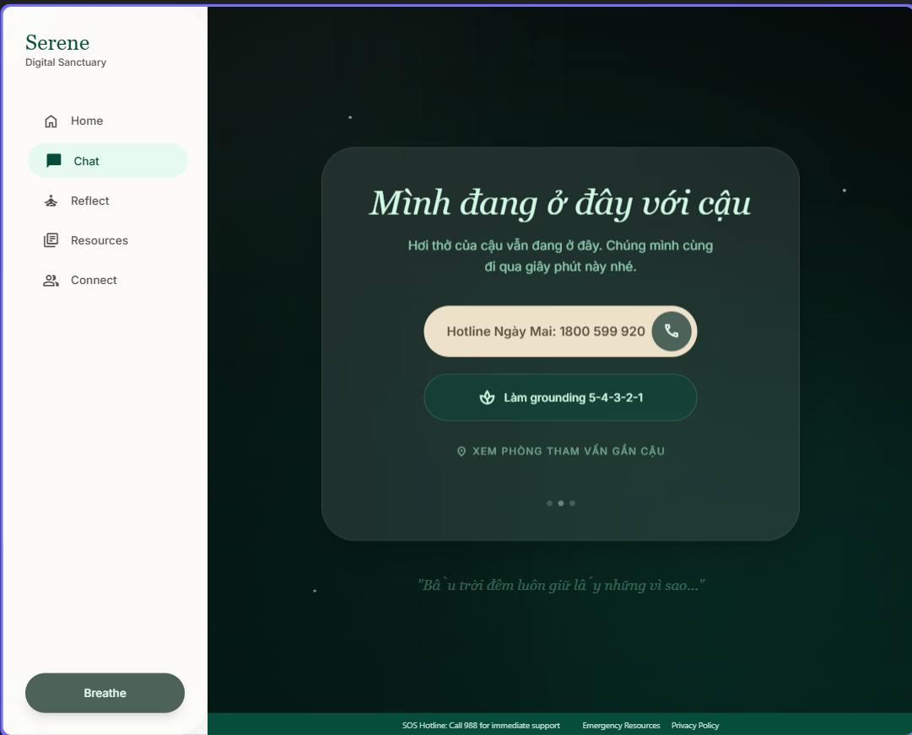

**Mô tả:** Màn hình nền tối (deep teal/dark green) — phân biệt rõ với giao diện bình thường. Sidebar nav vẫn hiển thị nhưng bị mờ. Center card tối màu:
- Headline lớn serif trắng: *"Mình đang ở đây với cậu"*
- Sub-text: *"Hơi thở của cậu vẫn đang ở đây. Chúng mình cùng đi qua giây phút này nhé."*
- Button pill lớn xanh lá: *"Hotline Ngày Mai: 1800 599 920"*
- Button outline: *"Làm grounding 5-4-3-2-1"*
- Text link nhỏ: *"© XEM PHÒNG THAM VẤN GẦN CẬU"*
- Pagination dots (SOS có thể multi-card)

Footer: *"SOS Hotline: Call 888 for immediate support · Emergency Resources · Privacy Policy"*. Quote italic dưới cùng.

**Điểm thiết kế quan trọng:**
- Màu nền tối chủ động để phân biệt context khẩn cấp — không gây hoảng loạn thêm mà tạo cảm giác *"không một mình"*.
- **SOS = referral, không phải live handoff** (ARCHITECTURE §IX nguyên tắc 6) — chỉ hiển thị hotline và grounding exercise, không kết nối counselor trực tiếp.
- Grounding 5-4-3-2-1 là bài tập tức thời cho người dùng trong lúc chờ gọi hotline.
- Kích hoạt trong < 2 giây kể từ khi Safety Agent phát hiện rủi ro (MVP Canvas §8 KPI).

---

## 7. Reflect — Wellness Summary

> **Mục đích:** Tab Reflect hiển thị tổng kết sức khỏe tinh thần cá nhân hóa. Kết hợp dữ liệu từ mood history và implicit clinical scoring.
> **Kết nối kiến trúc:** Output của Agent Analyst (batch) + long-term storage. User Journey §V bước 3 (buổi tối).

### 7.1 Reflect — "Chào Elena" Dashboard

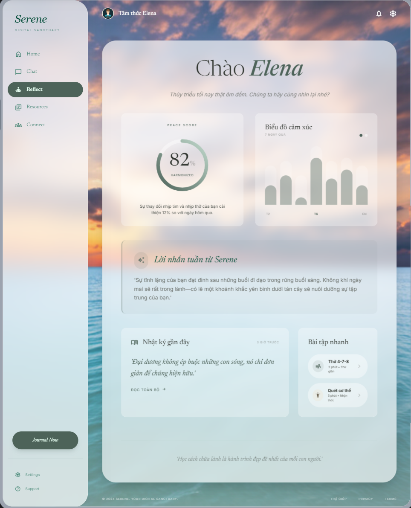

**Mô tả:** Layout sidebar + main. Heading: *"Chào Elena"* + sub-text khuyến khích. Wellness score circle lớn: **82** với màu xanh. Bar chart 7 ngày (mood trend). Dưới: hai card —
- *"Lời nhắn tuần từ Serene"*: đoạn text tổng hợp tuần (ví dụ: nhận diện suy nghĩ "tất cả hoặc không có gì" và kỹ thuật nhận diện "Tảng băng"). Weekly insights từ Analyst + Friend rewrite.
- *"Nhắc việc cho bạn"*: checklist micro-tasks (Bài tập thở, Journal prompt). Sidebar phải: Quick replies gợi ý.

**Điểm thiết kế quan trọng:**
- Điểm 82 là composite score từ mood history + PHQ-9 coverage — **không hiển thị PHQ-9/GAD-7 trực tiếp** để tránh medicalizing UX.
- *"Lời nhắn tuần từ Serene"* = `Analyst + Friend rewrite` (ARCHITECTURE §VIII) — Analyst tổng hợp insight lâm sàng, Friend viết lại bằng ngôn ngữ đồng cảm Gen Z.
- B2B layer: dữ liệu aggregate vào Dashboard nhà trường sau khi PII Masking (PRD §4 — *"Báo cáo chuyên môn"* User Story).

---

## 8. Resources — Content Library

> **Mục đích:** Thư viện nội dung self-help được tuyển chọn — meditation, breathing, journaling. Nội dung tĩnh kết hợp gợi ý cá nhân hóa từ Analyst.
> **Kết nối kiến trúc:** Static Self-help library + CBT Coping Skills KB (ARCHITECTURE §VIII).

### 8.1 Resources — "Khám phá Sự bình yên" Grid

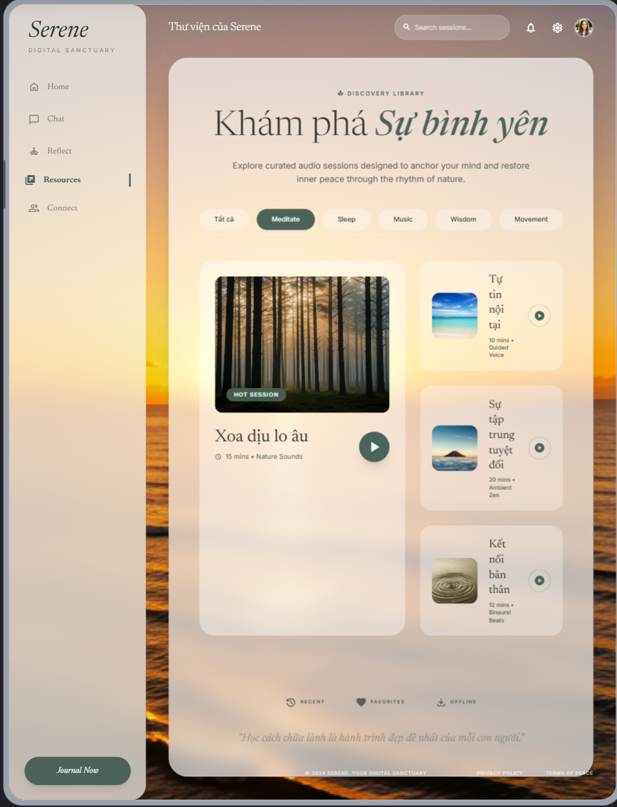

**Mô tả:** Header: badge *"DISCOVERY LIBRARY"*, headline *"Khám phá Sự bình yên"*. Filter tabs: *Tất cả · Mindset · Breath · Movement*. Grid content cards (thumbnail + tiêu đề + duration): *Xoa địa lo âu* (video, có play button), cùng nhiều card nhỏ hơn. Sidebar phải: vertical list thumbnail.

---

### 8.2 Resources — Alternate View với Hotline Banner

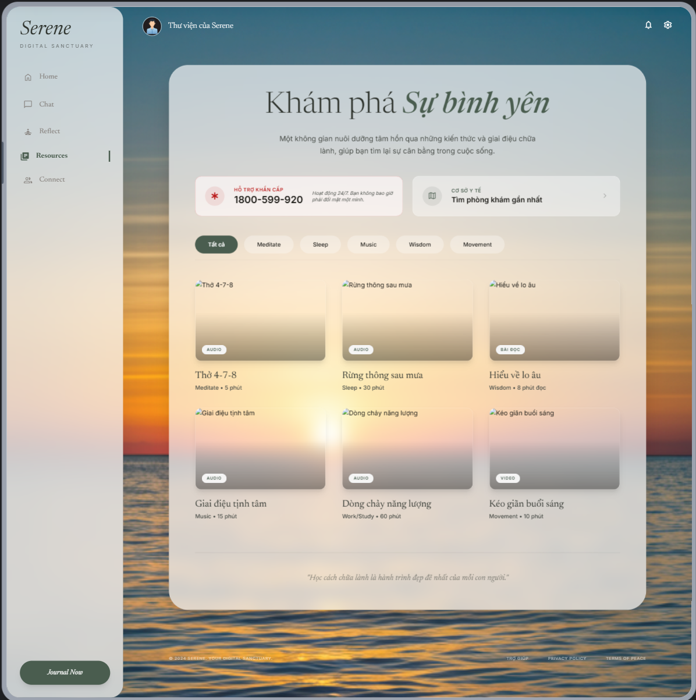

**Mô tả:** Cùng layout Resources nhưng có banner hotline nổi bật ở trên cùng: *"1800-599-920"* và *"Tìm phòng tham vấn gần mình"*. Grid phía dưới: *Thở 4-7-8*, *Rừng Rậm Mưa Rơi*, *Nhắn về cảm xúc*, *Guốc điện xoa nắng*, *Đứng dưới sóng nắng*, *Kéo giãn buổi sáng*.

**Điểm thiết kế quan trọng:**
- Banner hotline luôn visible trên Resources tab → bất cứ lúc nào user cũng có thể tiếp cận số khẩn cấp (Safety First UX).
- Content cards có duration label (e.g. *"3-5 min"*) giúp user chọn theo thời gian disponible.

---

### 8.3 Sleep Sanctuary

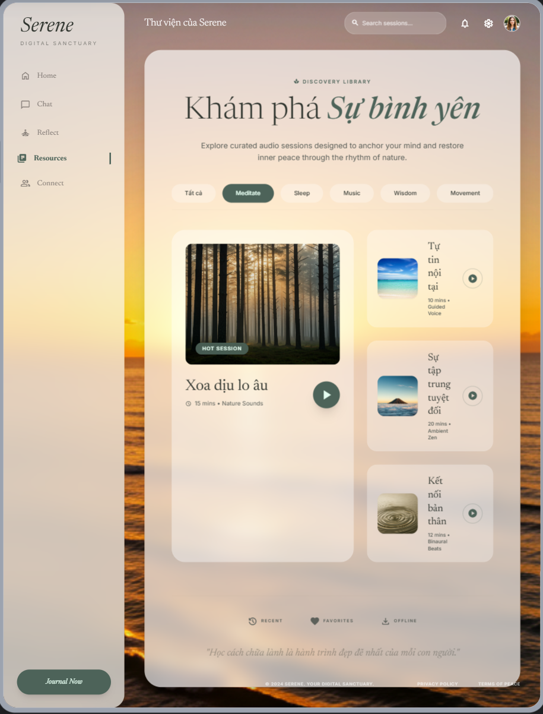

**Mô tả:** Sub-section *"Sleep Sanctuary"* trong Resources. Header serif italic. Filter tabs: *All · Meditate · Sleep · Relax · Discover*. Grid 2 cột:
- **Sleep Stories**: *The Midnight Woods of Norfolk*, *Sunlight over the Alps*, *The Deeper Express* (thumbnail + duration).
- **Soundscapes**: *Soft Rain on Tiles*, *Midnight Cafe*, *Cracking Hearth*.

Quote italic ở footer.

---

### 8.4 Resources Library — Alternative Layout

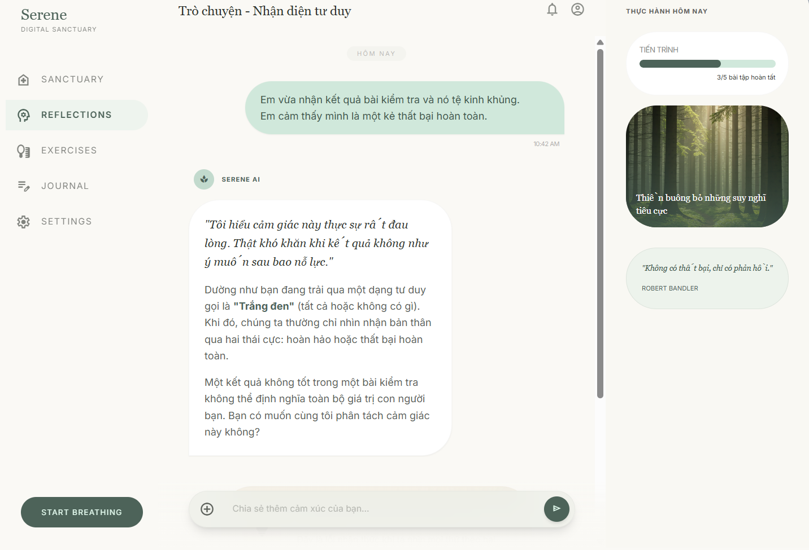

**Mô tả:** Phiên bản khác của Resources grid, có thể là trạng thái filter đã chọn. Bố cục tương tự, nhấn mạnh vào content discovery.

---

## 9. Connect — Hotline & Map

> **Mục đích:** Tab Connect cung cấp thông tin hỗ trợ khẩn cấp, hotline, và vị trí phòng tham vấn gần nhất.
> **Kết nối kiến trúc:** Static referral + Folium/react-leaflet map (ARCHITECTURE §VIII: *"Connect (Hotline + Map) — SOS hoặc user mở tự — Static referral + Folium map"*).

### 9.1 Connect — "You Are Not Alone"

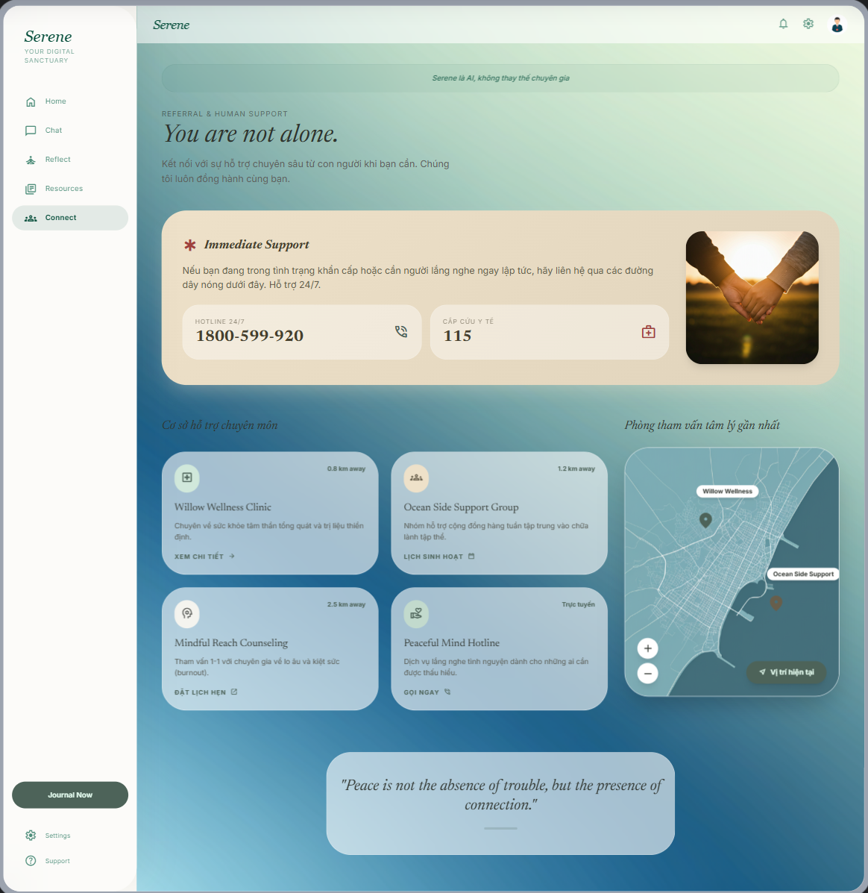

**Mô tả:** Headline serif: *"You are not alone."* + sub-text tiếng Việt khuyến khích tìm kiếm hỗ trợ. Card nổi bật xanh đậm: *"Immediate Support"* với số *1800-599-920* và *115* (cấp cứu). Grid 4 card dịch vụ: *UEH Wellness Clinic*, *Online Help Support Group*, *OnedBark Counselling*, *Peaceful Mind Hotline*. Bản đồ react-leaflet bên phải hiển thị phòng tham vấn gần nhất. Quote footer.

**Điểm thiết kế quan trọng:**
- Số *115* (cấp cứu quốc gia) được hiển thị cùng hotline Serene — đảm bảo an toàn tuyệt đối trong trường hợp nguy hiểm tính mạng.
- Map render với `react-leaflet` (ARCHITECTURE §XI frontend libs).
- Tab Connect accessible từ sidebar nav bất cứ lúc nào — không chỉ từ SOS flow.

---

## 10. Breath — Bài tập thở

> **Mục đích:** Trải nghiệm thiền thở guided, immersive. Người dùng có thể truy cập từ Home, Chat card gợi ý, hoặc navbar.
> **Kết nối kiến trúc:** Static self-help, không gọi LLM. User Journey §V bước 2 (buổi sáng — thiền 5 phút).

### 10.1 Breath — Landing Page (4-7-8 Timer)

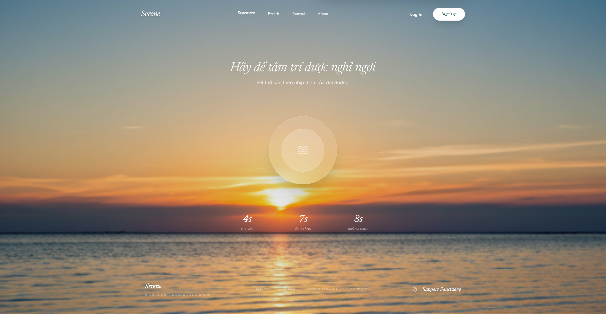

**Mô tả:** Full-page nền hoàng hôn biển. Headline: *"Hãy để tâm trí được nghỉ ngơi"*. Sub-text giới thiệu kỹ thuật thở từ đại dương. Center: vòng tròn pulse animation lớn (breathing guide visual). Timer display: *4s · 7s · 8s* (Inhale · Hold · Exhale). Footer: *"Serene"* logo + *"© Digital Sanctuary"*.

---

### 10.2 Breath — Immersive Underwater Experience

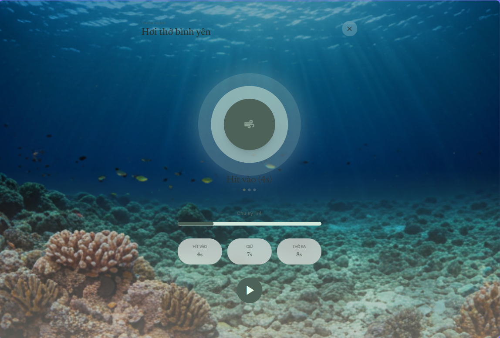

**Mô tả:** Chế độ immersive với background ảnh underwater coral reef. Vòng tròn breathing guide ở giữa, màu trắng/trong suốt, có pulse animation. Dưới: 3 nút thời gian (4s, 7s, 8s) + nút Play. Navigation breadcrumb *"Đại dương trong tâm"* ở trên.

**Điểm thiết kế quan trọng:**
- Background thay đổi theo loại bài tập (hoàng hôn cho 4-7-8 cơ bản, underwater cho session chuyên sâu).
- Sử dụng `lottie-react` cho pulse animation (ARCHITECTURE §XI).
- Kết nối với Chat: khi Friend gắn card *"BÀI TẬP Thở 4-7-8"*, click card dẫn vào đây.

---

## 11. Settings — Cài đặt

> **Mục đích:** Tùy chỉnh trải nghiệm cá nhân, quản lý thông báo và giao diện.
> **Kết nối kiến trúc:** User preferences → PostgreSQL (encrypted, ARCHITECTURE §XI).

### 11.1 Settings Page

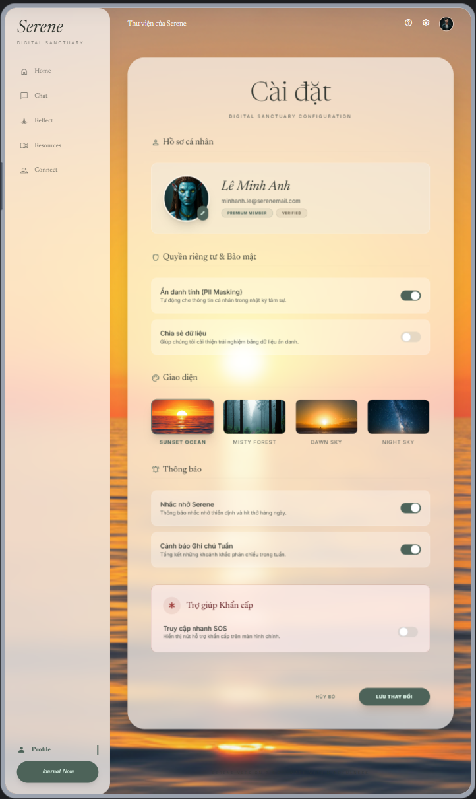

**Mô tả:** Nền ảnh hoàng hôn mờ. Card trắng trung tâm. Header: avatar tròn + *"Lê Minh Anh"*. Sections:
- *Quyền riêng tư & Bảo mật*: toggle ẩn danh.
- *Chủ đề giao diện*: toggle on/off.
- *Tùy chọn*: chọn theme ảnh nền (4 thumbnail: hoàng hôn biển, rừng, đêm, mặt trời).
- *Thông báo*: toggle *"Nhắc nhở hàng ngày"* + *"Lời nhắn từ Serene"*.
- *Tài khoản khác*: section phụ.

CTA *"Lưu thay đổi"* màu xanh rừng.

**Điểm thiết kế quan trọng:**
- Toggle ẩn danh ảnh hưởng đến mức độ PII được lưu (ARCHITECTURE §IX nguyên tắc 2).
- Theme backgrounds thay đổi toàn bộ giao diện app.

---

## 12. Admin — B2B Technical Dashboard

> **Mục đích:** Dashboard kỹ thuật dành cho admin / nhà trường. Theo dõi sức khỏe hệ thống multi-agent, guardrails, và traffic trends.
> **Kết nối kiến trúc:** MVP Canvas §7 Agent 4 (B2B Analyst). ARCHITECTURE §VIII *"Dashboard B2B — Batch job offline — Ẩn danh + aggregate"*. Chỉ số giám sát ARCHITECTURE §X.

### 12.1 Admin — "System Serenity" Dashboard

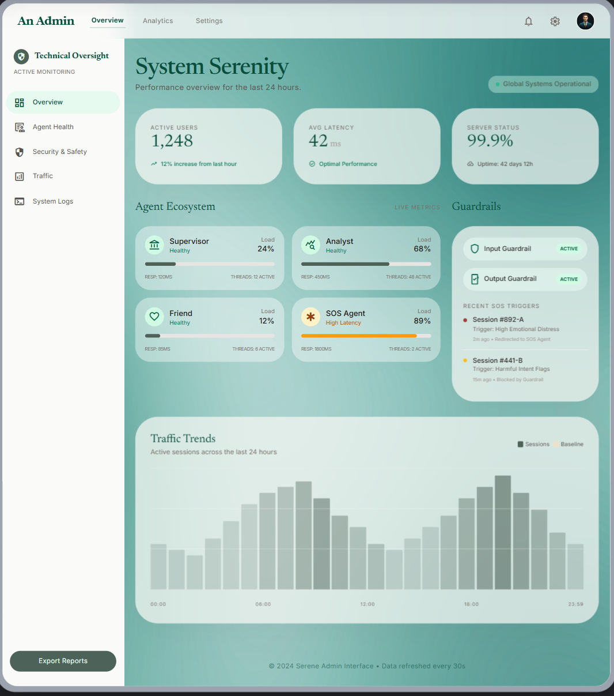

**Mô tả:** Nền teal đậm (phân biệt với giao diện user). Sidebar trái: *Technical Oversight* logo, menu: *Overview · Agent Trains · Security & Safety · System Logs*. Main area:

**Header metrics:**
- Total Conversations
- Support Performance
- System Uptime
- Update Actions

**Agent Ecosystem cards:**
- *Supervisor* — routing accuracy với progress bar
- *Analyst* — schema compliance + latency
- *Friend* — response quality metric
- *SOS Agent* — safety recall + status badge *"Session #662"*

**Guardrails panel:**
- *Input Guardrail* — active
- *Output Guardrail* — active
- *Session #662* — trigger log

**Traffic Trends:** Bar chart sessions theo ngày (7 ngày), dual color (Sessions vs Messages).

**CTA:** *"Export Reports"* button.

**Điểm thiết kế quan trọng:**
- Hiển thị trực tiếp các KPI từ ARCHITECTURE §X: *Supervisor routing accuracy ≥ 92%*, *Safety recall ≥ 99%*, *Schema compliance ≥ 99.5%*.
- SOS Agent có real-time session counter — admin thấy ngay số phiên khủng hoảng đang active.
- Dữ liệu đã qua PII Masking trước khi aggregate lên đây (PRD §4, ARCHITECTURE §IX nguyên tắc 2).

---

## 13. Reflections — CBT Chat View

> **Mục đích:** Tab Reflect/Reflections cho phép người dùng xem lại hội thoại được Analyst phân tích, kèm insight CBT được Friend viết lại bằng ngôn ngữ thân thiện.
> **Kết nối kiến trúc:** `Evaluator-Optimizer Pattern` (PRD §3.1) — Analyst phát hiện Cognitive Distortions, Friend rewrite insight trước khi hiển thị.

### 13.1 Reflections — CBT Analysis Chat

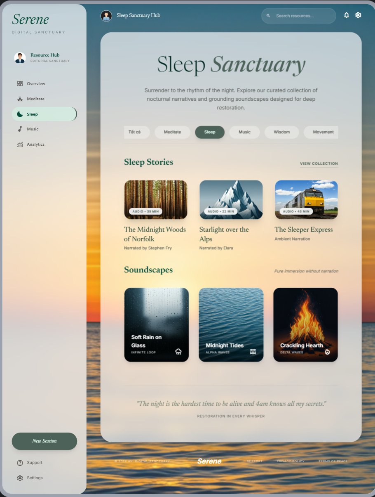

**Mô tả:** Layout 2 panel. Trái: chat thread với bubble user (nền trắng) và bubble Serene analysis (nền teal nhạt). Serene phân tích suy nghĩ *"tất cả hoặc không có gì"* (All-or-Nothing thinking), đặt tên là *"Tảng băng"*. Viết bằng ngôn ngữ thân thiện, không dùng thuật ngữ *"Cognitive Distortion"*. Phải: panel sidebar với quote và quick insight cards.

**Điểm thiết kế quan trọng:**
- Đây là output duy nhất của `KetQuaLamSang.loi_tu_duy_phat_hien[]` được hiển thị cho user — thông qua Friend rewrite (ARCHITECTURE §I: *"Analyst không nói trực tiếp với user"*).
- Tone của Serene analysis vẫn là đồng hành, không phán xét — tránh cảm giác "bị phân tích".
- Session này chỉ hiển thị trong Reflect tab, không xuất hiện trong Chat tab chính.

---

*Tài liệu này được tổng hợp từ PRD.md, MVP_CANVAS.md, và ARCHITECTURE.md. Mỗi màn hình được ánh xạ trực tiếp đến agent hoặc tính năng kỹ thuật tương ứng trong kiến trúc hệ thống.*
