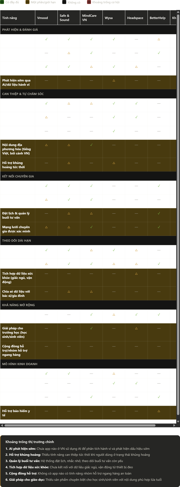

##  CHỦ ĐỀ: AI20K030 - SÀNG LỌC & HỖ TRỢ SỨC KHỎE TÂM THẦN
## DỰ ÁN: Multi-Agent Therapist Sàng Lọc và Hỗ Trợ Sức Khỏe Tinh Thần

## I. Bối cảnh

- **Pain points**
    - **Thiếu hụt nguồn nhân lực và phòng ban Tâm thần tại các bệnh viện:** Theo số liệu của Bộ Y tế, tỷ lệ mắc 10 rối loạn tâm thần thường gặp là 14,9% dân số, nghĩa là gần 15 triệu người bị ảnh hưởng. Trong khi đó lượng bác sĩ chuyên khoa tâm thần chỉ khoảng dưới 1000 người trên cả nước, nhiều bệnh viện đa khoa chưa có khoa tâm thần gây tập trung quá lớn tại các chuyên khoa tâm thần tuyến Trung ương.
    - **Tác động xã hội:** Tỷ lệ người lao động bị căng thẳng (stress) cao (khoảng 42%), số người tự sát có xu hướng gia tăng, báo hiệu một cuộc khủng hoảng sức khỏe tâm thần tiềm ẩn.
    - Kỳ thị xã hội về việc đi khám sức khỏe tâm thần (”điên”, “yếu đuối”, “phí tiền”,…) khiến >60% người có triệu chứng không tìm kiếm sự hỗ trợ
- **Lý do dự án tồn tại:**
    - Đáp ứng nhu cầu của người trẻ trong xã hội hiện nay là cần một nơi để giãi bày, sẻ chia
    - Chưa phải là phương pháp thay thế bác sĩ nhưng có tác dụng khuyến khích người dùng quan tâm tới sức khỏe tâm lý của mình
    - Số hóa việc tiếp cận dịch vụ chăm sóc tâm thần để mọi người dễ tiếp cận, dễ được trợ giúp
    

## II. Chân dung người dùng

1. **Nhân khẩu học**
- **Nhân khẩu học: 18 - 24 tuổi**
- Nghề nghiệp: Sinh viên, Người mới đi làm
- **Tình trạng:** Đang đối mặt với áp lực học tập, định hướng nghề nghiệp, khurng hoảng cuộc sống hoặc các vấn đề về mối quan hệ.

Ví dụ

1. **Hành vi tâm lý**
- **Thói quen công nghệ**: Hưởng ứng các xu hướng công nghệ hiện nay được tích hợp AI, thích trải nghiệm mới mẻ, không cần đăng ký phức tạp.
- **Mục tiêu cá nhân:** Được lắng nghe, chia sẻ, giảm bớt lo âu, kiểm soát được cảm xúc, ngủ ngon hơn, cải thiện năng suất làm việc/học tập, duy trì mối quan hệ tốt.
- **Rào cản:**
    - Định kiến xã hội (“ngại nói ra”, sợ bị đồng nghiệp/phụ huynh biết).
    - Thiếu kiến thức (“không biết mình đang bị gì”).
    - Thời gian hạn chế (“không muốn mất 1–2 tiếng đi khám”).
    - Nghi ngờ hiệu quả app (“chỉ là trò chuyện máy móc”).

## III. Phân tích đối thủ

**a. Đối thủ trực tiếp (Việt Nam):**

1. **Vmood**: Tập trung trầm cảm, sàng lọc cảm xúc + kỹ năng tự quản lý miễn phí, kết nối chuyên gia khi nặng.
2. **Safe and Sound**: 3 trụ cột (phát hiện sớm – kết nối chuyên gia – theo dõi dài hạn), ra mắt 2022, miễn phí tải.
3. **MindCare Việt Nam**: Đánh giá tâm lý chuyên sâu cho cá nhân + tổ chức/trường học/doanh nghiệp, tham vấn trực tuyến/trực tiếp.

**b.Đối thủ gián tiếp:**

- App quốc tế: Wysa (AI chatbot), Headspace/Calm (thiền định), BetterHelp/Talkspace (therapy online).
- Công cụ web: Test DASS-21, PHQ-9 miễn phí trên các trang bệnh viện/tâm lý.

**Ma trận tính năng**

## IV. Khoảng trống thị trường và Cơ hội cho dự án

**1. AI phát hiện sớm và dự đoán rủi ro**

Wysa có chatbot AI nhưng chủ yếu để trò chuyện, không phân tích sâu
Cơ hội: Xây dựng AI phân tích pattern hành vi, giấc ngủ, giao tiếp để cảnh báo sớm

**2. Hỗ trợ khủng hoảng tức thời**

Safe & Sound và Wysa có một phần nhưng không chuyên sâu
Cơ hội: Hotline tự động, kết nối khẩn cấp, kịch bản can thiệp theo mức độ nghiêm trọng

**3. Nội dung địa phương hóa**

Các app quốc tế không có nội dung tiếng Việt hoặc phù hợp văn hóa Việt
Vmood và SnS có nhưng chưa toàn diện
Cơ hội: CBT/DBT được điều chỉnh theo văn hóa, case study Việt Nam, âm thanh thiền định tiếng Việt

**4. Quản lý chăm sóc toàn diện**

Chỉ BetterHelp có hệ thống quản lý buổi tư vấn tốt
Cơ hội: Lịch hẹn thông minh, nhắc nhở uống thuốc, theo dõi tuân thủ điều trị, kết nối với bác sĩ

**5. Tích hợp sức khỏe tổng thể**

Không app nào kết nối tốt với dữ liệu giấc ngủ, vận động, dinh dưỡng
Cơ hội: Tích hợp Apple Health/Google Fit, phân tích mối liên hệ giữa thể chất và tinh thần

**6. Cộng đồng an toàn**

Hoàn toàn bị bỏ trống ở cả thị trường Việt Nam và quốc tế
Cơ hội: Nhóm hỗ trợ có kiểm duyệt, chia sẻ câu chuyện ẩn danh, mentor phục hồi

## V. Phạm vi dự án

**Phạm vi (Scope):**

1. **In-scope (MVP):**
- Công cụ sàng lọc khoa học (PHQ-9, GAD-7, PSS… được validate cho VN).
- AI nhận diện lối suy nghĩ và cảm xúc, từ đó lập hồ sơ người dùng và đưa ra lời khuyên phù hợp.
- Dashboard cá nhân.
- Bảo mật dữ liệu 

1. **Out-of-scope (tránh scope creep):**
- Trẩn đoán bệnh tâm thần và đưa ra lộ trình điều trị
