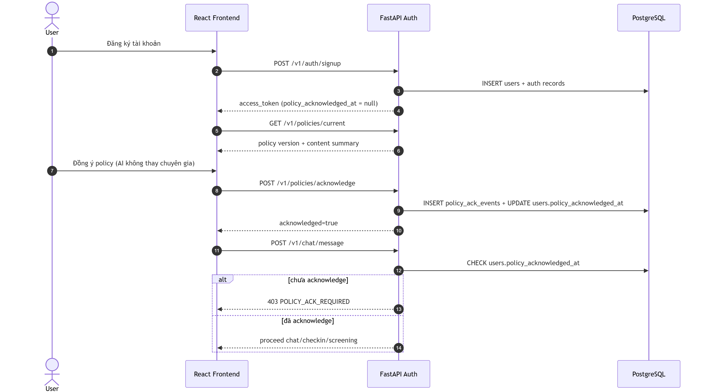

# Sequence Diagrams 

**Phiên bản:** 3.0 | **Cập nhật:** 2026-04-16

---

## Diagram 1 — Guest-first vào app → chọn nhu cầu → Safety Gate

Luồng khách mở app không đăng ký, chọn nhu cầu (Check-in / Screening / Chat), gọi API guest session, sau đó qua Safety Gate (`POST /v1/intake/safety-check`): service đánh giá rủi ro; nếu cần hướng crisis thì ghi pre-flag Postgres và trả route + hotline, ngược lại vào flow đã chọn.

---

## Diagram 2 — Chat message (Mây) → LangGraph → sync writes + async pipeline

Luồng gửi tin nhắn chat: frontend → FastAPI; middleware tải working memory (Redis cache / Postgres); LangGraph (Supervisor / Analyst / Friend) xử lý, nhánh crisis nếu cần; trả response; ghi đồng bộ messages và conversation trên Postgres; Celery xử lý bất đồng bộ cập nhật profile, memory embedding và `sync_outbox`.

---

## Diagram 3 — Session end summarizer → atomic profile update → outbox sync Neo4j

Khi hết phiên hoặc batch trigger: Session Summarizer đọc messages, tóm tắt (hoặc bỏ qua nếu đã tóm tắt / SOS / một tin), tạo embedding; trong một transaction Postgres ghi `conversation_memories`, cập nhật profile summaries, snapshot, `sync_outbox`; xóa cache Redis profile. Worker outbox định kỳ đọc outbox và đồng bộ lên Neo4j (User, Session, Trigger, Emotion, MemoryNode theo hợp đồng bootstrap).

---

## Diagram 4 — Crisis detected trong chat → de-escalation response + admin review

Tin nhắn có dấu hiệu tự hại: LangGraph gọi SOS handler; nếu vượt ngưỡng crisis thì bỏ qua path Analyst/Friend thường, trả payload de-escalation + hotline; ghi messages, `crisis_logs`, audit; cập nhật cờ an toàn trên profile; frontend hiển thị phản hồi crisis; thông báo admin; dashboard đọc và đánh dấu reviewed. `crisis_logs` không đi qua `sync_outbox` / Neo4j.

---

## Diagram 5 — Signup → policy acknowledgment bắt buộc → mở quyền core APIs

Đăng ký tạo user và token; client lấy policy hiện tại; user xác nhận policy; server ghi `policy_ack_events` và `policy_acknowledged_at`. Các API nhạy cảm (ví dụ chat) kiểm tra acknowledgment — chưa xác nhận thì 403, đã xác nhận thì cho phép luồng chat / check-in / screening.

---

## Ghi chú triển khai

- Diagram 2, 3, 4 giữ đúng tinh thần từ ảnh cũ `dia1/2/3`: response nhanh, sync writes tối thiểu bắt buộc, async enrich phía sau.
- Outbox Neo4j bám hợp đồng runtime trong `neo4j_bootstrap_v3.cypher` (User/Session/MemoryNode và các quan hệ hành vi).
- Luồng crisis đã cập nhật theo plan mới: ưu tiên de-escalation + hotline song song, không ép một kiểu “hard block” duy nhất ở frontend.
- `crisis_logs` là dữ liệu nhạy cảm: chỉ ở Postgres/admin flow, không sync graph.
