# Sequence diagrams — Serene

## Summary

Tài liệu này tập hợp **13 sequence diagram** mô tả luồng chính của Serene: chat thường, phân tích pattern, an toàn SOS, giọng nói khủng hoảng và TTS, persona và phần thưởng, bộ nhớ, đồng bộ graph/dashboard, screening có hướng dẫn, knowledge unlock và vòng lặp end-to-end. Mỗi mục gồm **tiêu đề**, **ảnh PNG** trong thư mục `docs/sequence/` và **mô tả luồng ngắn** ngay bên dưới.

**Quy ước thuật ngữ (khớp `docs/PRD.md`):** Ba vai trò LLM/runtime chính được gọi theo **tên agent sản phẩm**, kèm **mã bước orchestration** trong backtick khi cần chỉ code hoặc LangGraph:
Mapping chuẩn giữa tên vai trò, orchestration id và runtime tokens: `docs/GLOSSARY_RUNTIME.md`.

| Tên agent (sản phẩm) | Mã triển khai | Vai trò ngắn |
|----------------------|----------------|---------------|
| **Serene Conversation Agent** | `FriendNode` | Một identity Serene; phản hồi user-facing trong luồng bình thường; persona là style mode bên trong agent này. |
| **Internal Analyst Agent** | `AnalystNode` | Chỉ xuất `AnalystBundle` (JSON có cấu trúc); không nói trực tiếp với user. |
| **Safety Agent** | `SafetyFinalizer` | Luồng high-risk / SOS; payload kiểm soát, deterministic. |

Các thành phần khác (`SafetyGate`, `DistressRouter`, `PersonaRouter`, service/worker…) **không** là agent có identity riêng theo PRD. Không dùng từ **node** để chỉ agent; chỉ dùng “node” theo nghĩa graph Neo4j nếu có (ví dụ `:MemoryNode` trong PRD).

**Tên file ảnh:** toàn bộ PNG trong `docs/sequence/` dùng **kebab-case** (chữ thường, dấu `-`, không khoảng trắng) để Markdown preview hiển thị ổn định.

---

## Mục lục — các loại biểu đồ

| # | Loại / chủ đề | Mục trong tài liệu |
|---|----------------|-------------------|
| 1 | Chat thường — Serene Conversation Agent | [§1](#sec-seq-1) |
| 2 | Pattern insight — Internal Analyst rồi Serene Conversation | [§2](#sec-seq-2) |
| 3 | High-risk / SOS — Safety Agent | [§3](#sec-seq-3) |
| 4 | SOS voice — CrisisInterventionPlan + TTS dedup | [§4](#sec-seq-4) |
| 5 | Frontend TTS polling — trạng thái job | [§5](#sec-seq-5) |
| 6 | Persona — chọn / unlock / safety fallback | [§6](#sec-seq-6) |
| 7 | Heart reward — luồng idempotent | [§7](#sec-seq-7) |
| 8 | Reward store — mua + unlock persona | [§8](#sec-seq-8) |
| 9 | Memory cards — async + kiểm soát user | [§9](#sec-seq-9) |
| 10 | Neo4j async + dashboard materialization | [§10](#sec-seq-10) |
| 11 | Guided screening — không chẩn đoán | [§11](#sec-seq-11) |
| 12 | Knowledge unlock — hoàn thành + reward | [§12](#sec-seq-12) |
| 13 | End-to-end release — chat tới retention | [§13](#sec-seq-13) |

Dưới đây là phần **mô tả luồng ngắn gọn, logic, theo từng sequence diagram**. Nội dung đặt ngay dưới từng ảnh.

---

## 1. Normal Chat Turn — Serene Conversation Agent (direct)

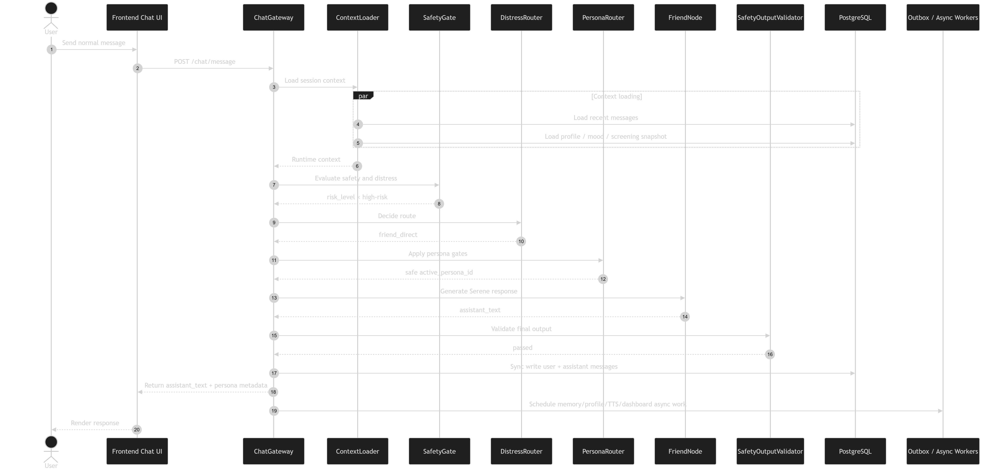

1. User gửi một tin nhắn thông thường từ Chat UI.
2. Frontend gọi `ChatGateway` qua API chat.
3. `ContextLoader` tải recent messages, profile, mood và screening snapshot từ PostgreSQL.
4. `SafetyGate` kiểm tra safety/distress trước mọi orchestration khác.
5. Vì không có high-risk signal, `DistressRouter` chọn route `friend_direct`.
6. `PersonaRouter` kiểm tra persona hiện tại, unlock state, cooldown và safety fallback.
7. **Serene Conversation Agent** (`FriendNode`) tạo phản hồi user-facing với identity Serene và persona style hợp lệ.
8. `SafetyOutputValidator` kiểm tra output cuối cùng để tránh diagnosis, unsafe advice hoặc persona drift.
9. API ghi user message và assistant message vào PostgreSQL.
10. Async workers được enqueue cho memory, profile, dashboard hoặc TTS nếu cần.
11. Frontend render phản hồi cho user.

---

## 2. Pattern Insight Turn — Internal Analyst Agent, then Serene Conversation Agent

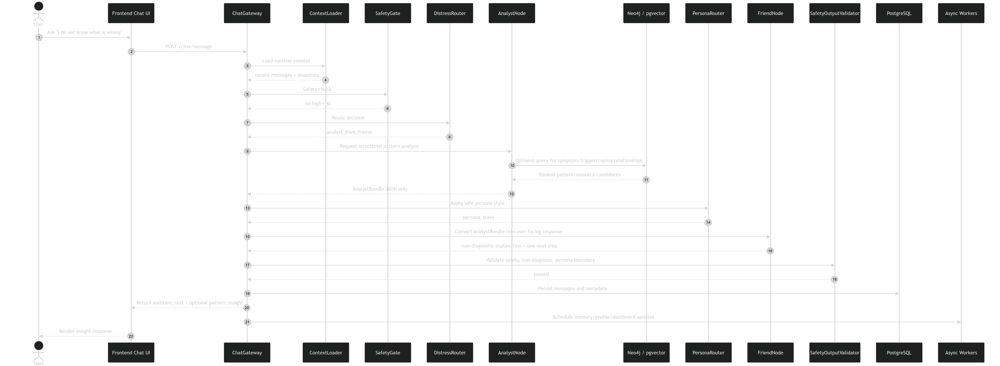

1. User hỏi một câu cần phân tích pattern, ví dụ “mình không biết mình bị sao”.
2. `ChatGateway` nhận request và tải runtime context.
3. `SafetyGate` kiểm tra trước để đảm bảo không phải high-risk turn.
4. `DistressRouter` xác định cần route `analyst_then_friend`.
5. **Internal Analyst Agent** (`AnalystNode`) chạy nội bộ và tạo `AnalystBundle` dạng JSON, không nói trực tiếp với user.
6. Nếu cần, **Internal Analyst Agent** (`AnalystNode`) truy vấn Neo4j hoặc pgvector để lấy pattern/resource liên quan.
7. `PersonaRouter` áp dụng style mode an toàn.
8. **Serene Conversation Agent** (`FriendNode`) chuyển `AnalystBundle` thành câu trả lời tự nhiên, không chẩn đoán, có một next step rõ ràng.
9. `SafetyOutputValidator` kiểm tra non-diagnosis, privacy và persona boundary.
10. PostgreSQL lưu message và metadata.
11. Async workers cập nhật memory, profile, dashboard hoặc graph-derived insight.

---

## 3. High-Risk / SOS Turn — Safety Agent (deterministic)

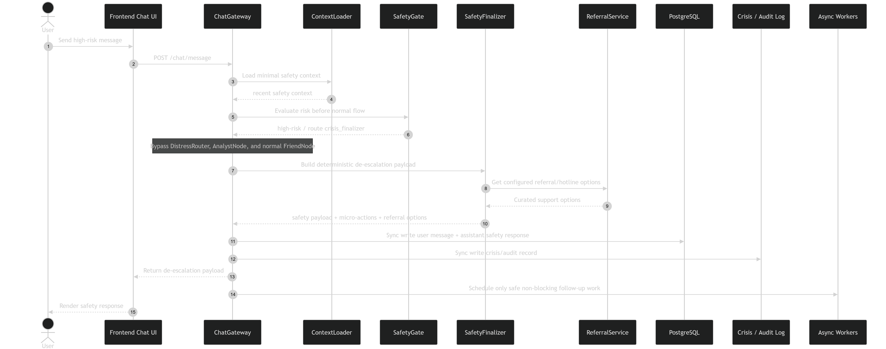

1. User gửi tin nhắn có dấu hiệu high-risk hoặc SOS.
2. `ChatGateway` chỉ tải context tối thiểu cần cho safety.
3. `SafetyGate` chạy đầu tiên và phát hiện high-risk.
4. Hệ thống bypass `DistressRouter`, **Internal Analyst Agent** (`AnalystNode`) và **Serene Conversation Agent** (`FriendNode`) ở luồng bình thường.
5. **Safety Agent** (`SafetyFinalizer`) tạo de-escalation payload theo contract deterministic.
6. `ReferralService` cung cấp hotline/referral options từ nguồn cấu hình có kiểm duyệt.
7. API ghi user message, assistant safety response và crisis/audit log vào PostgreSQL.
8. Frontend nhận de-escalation payload.
9. UI render safety response, micro-actions hoặc referral options.
10. Async follow-up chỉ chạy nếu an toàn và không thay thế safety-critical sync writes.

---

## 4. SOS Voice Intervention — CrisisInterventionPlan + TTS Dedup

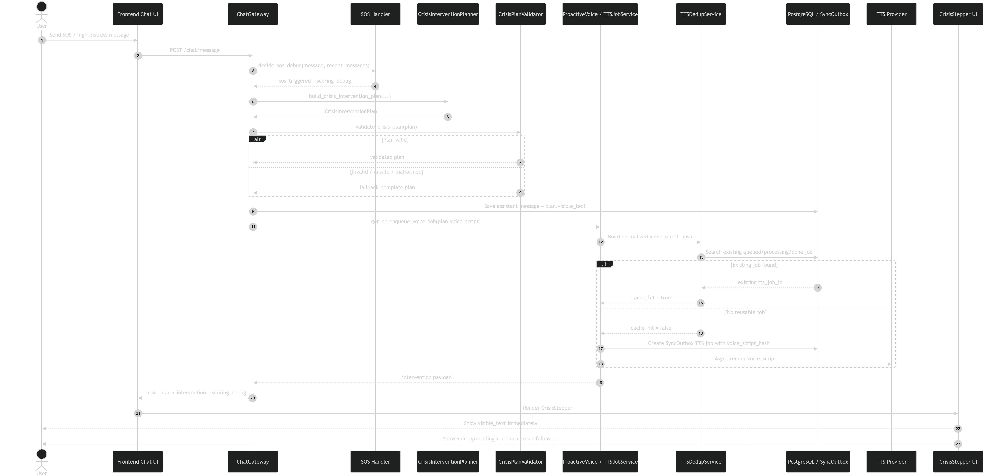

1. User gửi SOS/high-distress message.
2. Backend chạy `decide_sos_debug` để lấy `sos_triggered`, score và reason codes.
3. Nếu SOS được kích hoạt, `CrisisInterventionPlanner` tạo `CrisisInterventionPlan` (thành phần định hướng nội dung khủng hoảng + giọng đọc; không phải một trong ba agent chính ở bảng trên).
4. Plan gồm `visible_text`, `voice_script`, `action_cards`, `follow_up_question` và safety metadata.
5. `CrisisPlanValidator` kiểm tra plan: không diagnosis, không hotline bịa, không unsafe content, `visible_text` khác `voice_script`.
6. Nếu LLM output lỗi hoặc unsafe, hệ thống dùng deterministic fallback plan.
7. Backend lưu assistant message bằng `plan.visible_text`.
8. TTS service nhận `plan.voice_script`, không dùng `visible_text` để đọc lại.
9. `TTSDedupService` tạo hash từ normalized `voice_script` và voice config.
10. Nếu đã có queued/processing/done job trùng hash, hệ thống reuse job cũ.
11. Nếu chưa có, backend tạo TTS job mới trong outbox.
12. API trả về `crisis_plan`, `intervention` và `scoring_debug`.
13. Frontend render `CrisisStepper` với voice grounding, action cards và follow-up.

---

## 5. Frontend TTS Polling — Queued / Processing / Ready / Failed

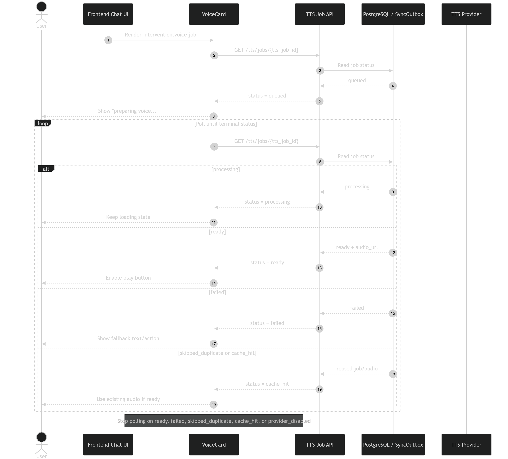

1. Frontend nhận `tts_job_id` hoặc intervention voice payload.
2. `VoiceCard` bắt đầu gọi API để kiểm tra trạng thái job.
3. Nếu status là `queued`, UI hiển thị trạng thái đang chuẩn bị voice.
4. Nếu status là `processing`, UI tiếp tục loading và polling.
5. Nếu status là `ready`, API trả `audio_url`, UI bật nút play.
6. Nếu status là `failed`, UI dừng polling và hiển thị fallback action/text.
7. Nếu status là `cache_hit` hoặc `skipped_duplicate`, UI dùng audio/job đã có nếu khả dụng.
8. Polling phải dừng ở terminal status: `ready`, `failed`, `cache_hit`, `skipped_duplicate`, hoặc `provider_disabled`.

---

## 6. Persona Selection / Unlock / Safety Fallback

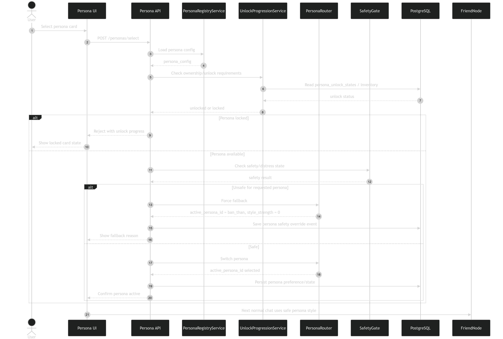

1. User chọn một persona card trong UI.
2. Frontend gửi request chọn persona đến backend.
3. `PersonaRegistryService` tải config của persona.
4. `UnlockProgressionService` kiểm tra persona đã unlock chưa.
5. Nếu persona bị khóa, API trả unlock progress cho frontend.
6. Nếu đã unlock, `SafetyGate` kiểm tra distress/risk hiện tại.
7. Nếu persona không an toàn trong trạng thái hiện tại, `PersonaRouter` fallback về `ban_than` hoặc giảm style strength (persona là style mode trong **Serene Conversation Agent**, không phải agent riêng).
8. Nếu an toàn, `PersonaRouter` cập nhật active persona cho turn tiếp theo của **Serene Conversation Agent** (`FriendNode`).
9. Backend lưu persona preference/state vào PostgreSQL.
10. Các turn chat tiếp theo dùng persona style đã chọn, nhưng vẫn bị safety override khi cần.

---

## 7. Heart Reward Event — Idempotent Reward Flow

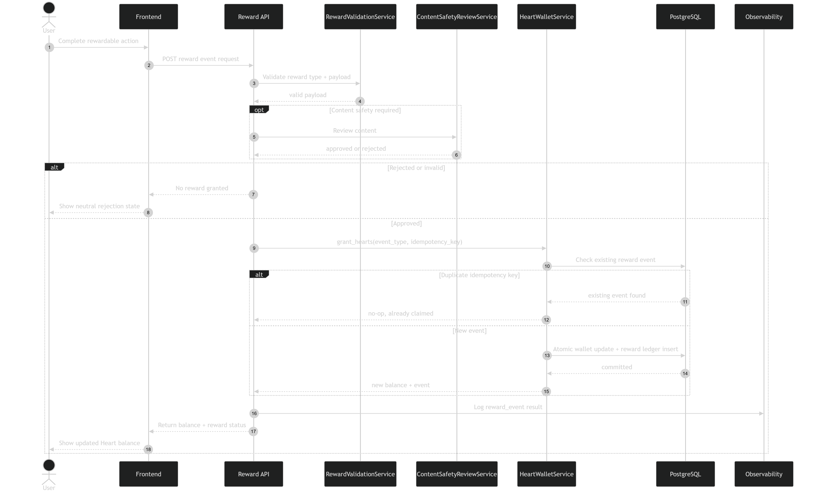

1. User hoàn thành một hành động có thể nhận Heart, ví dụ mood check-in, reflection hoặc knowledge card.
2. Frontend gửi reward event lên backend.
3. `RewardValidationService` kiểm tra event type, payload và điều kiện hợp lệ.
4. Nếu nội dung cần kiểm duyệt, `ContentSafetyReviewService` kiểm tra harmful/unsafe content.
5. Nếu invalid hoặc rejected, backend không cấp Heart.
6. Nếu approved, `HeartWalletService` xử lý reward bằng idempotency key.
7. Backend kiểm tra reward event đã được claim chưa.
8. Nếu trùng idempotency key, hệ thống no-op và trả trạng thái already claimed.
9. Nếu là event mới, wallet được cập nhật atomic trong PostgreSQL.
10. API trả reward status và balance mới cho frontend.
11. Frontend cập nhật Heart balance.

---

## 8. Reward Store Purchase + Persona Unlock

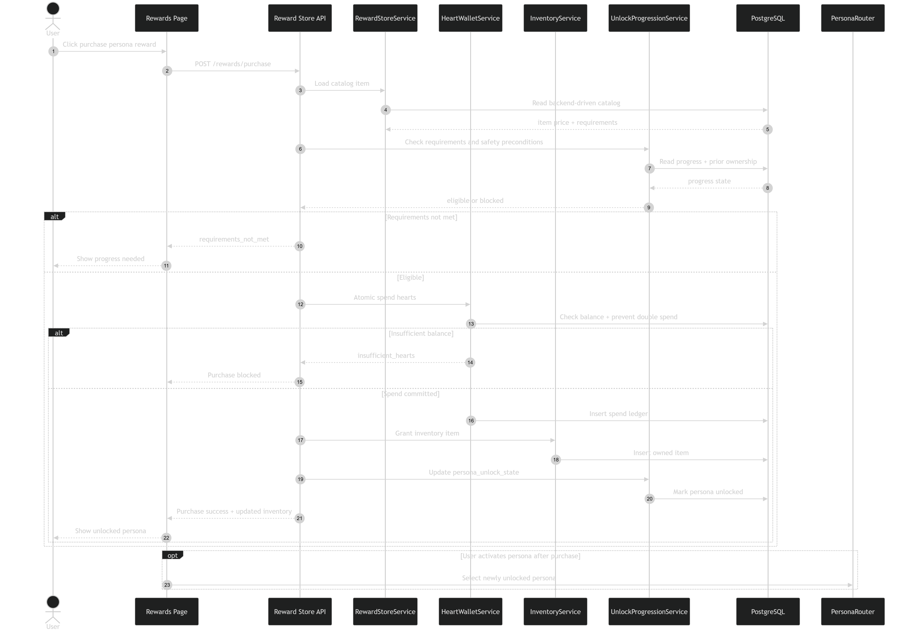

1. User bấm mua một reward item hoặc persona unlock trong Rewards Page.
2. Frontend gửi purchase request đến Reward Store API.
3. `RewardStoreService` tải catalog item từ backend, không từ hardcode frontend.
4. `UnlockProgressionService` kiểm tra requirement, ownership và safety preconditions.
5. Nếu requirement chưa đủ, API trả `requirements_not_met`.
6. Nếu đủ điều kiện, `HeartWalletService` kiểm tra balance.
7. Nếu không đủ Heart, API trả `insufficient_hearts`.
8. Nếu đủ Heart, backend thực hiện spend transaction atomic.
9. `InventoryService` cấp item vào inventory.
10. Nếu item là persona, backend cập nhật `persona_unlock_state`.
11. API trả purchase success và inventory state mới.
12. Frontend hiển thị persona/reward đã unlock.
13. User có thể kích hoạt persona sau khi mua, nhưng vẫn phải qua `PersonaRouter` và `SafetyGate` trước khi áp dụng vào **Serene Conversation Agent** (`FriendNode`).

---

## 9. Memory Cards Lifecycle — Async Extraction + User Control

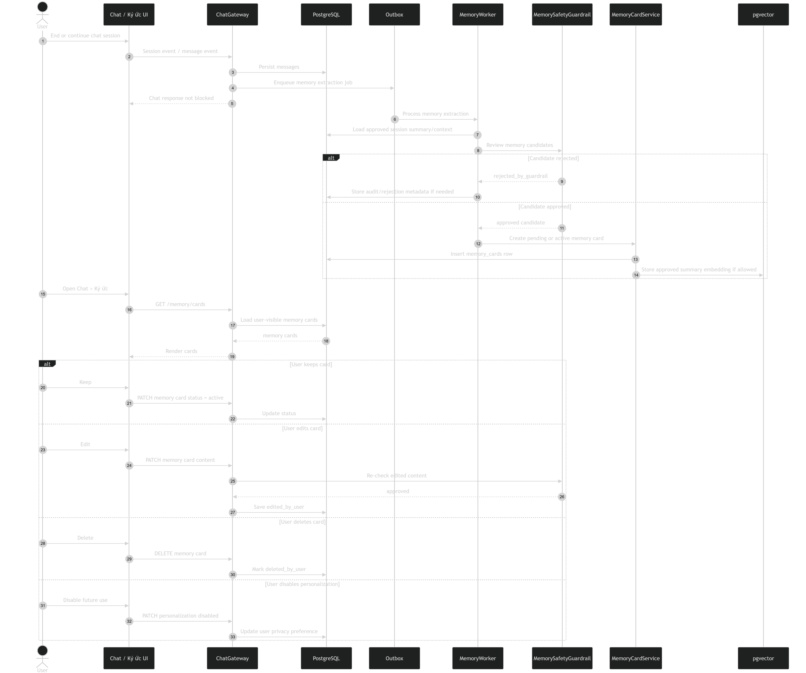

1. Sau chat/session event, API lưu message vào PostgreSQL.
2. API enqueue memory extraction job vào outbox, không block chat response.
3. `MemoryWorker` xử lý job async.
4. Worker tải session summary hoặc context đã được phép xử lý.
5. `MemorySafetyGuardrail` kiểm tra memory candidate.
6. Candidate unsafe hoặc sensitive quá mức bị reject.
7. Candidate hợp lệ được tạo thành Memory Card với trạng thái pending hoặc active.
8. Nếu được phép, summary embedding được lưu vào pgvector.
9. User mở tab `Chat > Ký ức`.
10. Frontend gọi API để lấy user-visible memory cards.
11. User có thể giữ, sửa, xóa hoặc tắt cá nhân hóa.
12. Mọi chỉnh sửa nhạy cảm phải được kiểm tra lại trước khi lưu.
13. Không có hidden memory ngoài hệ Memory Cards user kiểm soát.

---

## 10. Async Neo4j Sync + Dashboard Materialization

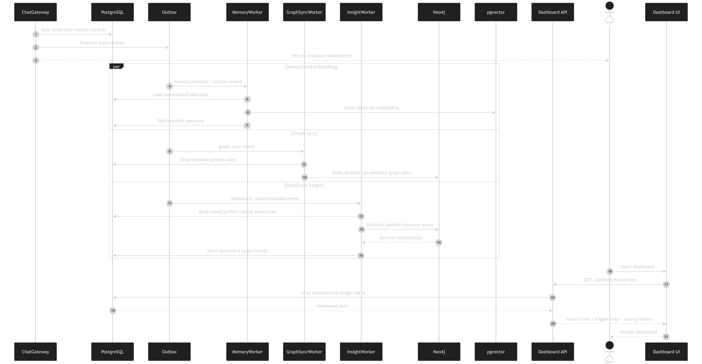

1. Chat response được trả cho user ngay sau sync write cần thiết.
2. API enqueue async events cho memory, graph sync, embedding và dashboard.
3. `MemoryWorker` xử lý summary, memory cards, profile patch hoặc embeddings.
4. `GraphSyncWorker` chỉ đọc derived pattern events, không đọc raw sensitive transcript.
5. Graph data được ghi vào Neo4j dưới dạng non-sensitive derived relationships (Neo4j **node**/relationship ở đây là khái niệm đồ thị, không chỉ agent).
6. `InsightWorker` tổng hợp mood trend, trigger map, coping history và dashboard cards.
7. Nếu cần, `InsightWorker` truy vấn Neo4j để lấy relationship insight.
8. Dashboard insights được materialize lại vào PostgreSQL.
9. Khi user mở dashboard, API đọc dữ liệu đã materialized.
10. Frontend render mood trend, trigger map, coping history và next steps.
11. Neo4j không bao giờ là source of truth và không chứa raw crisis/PII data.

---

## 11. Guided Screening Flow — Screening, Not Diagnosis

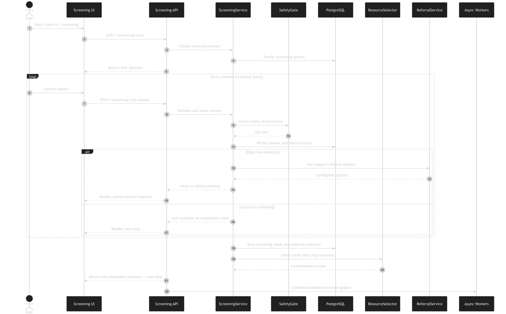

1. User bắt đầu một check-in hoặc screening flow.
2. Screening API tạo screening session.
3. `ScreeningService` gửi câu hỏi đầu tiên cho frontend.
4. User trả lời từng item.
5. Backend validate answer và cập nhật interim score.
6. `SafetyGate` kiểm tra safety implications trong quá trình screening.
7. Nếu phát hiện high-risk, flow chuyển sang **Safety Agent** (`SafetyFinalizer`) / safety pathway.
8. Nếu không high-risk, screening tiếp tục đến khi hoàn thành.
9. Kết quả được lưu như screening indicator, không phải diagnosis.
10. `ResourceSelector` chọn một next step hoặc resource phù hợp.
11. Frontend hiển thị summary theo ngôn ngữ non-diagnostic.
12. Async workers cập nhật dashboard/profile nếu phù hợp.

---

## 12. Knowledge Unlock Completion + Reward

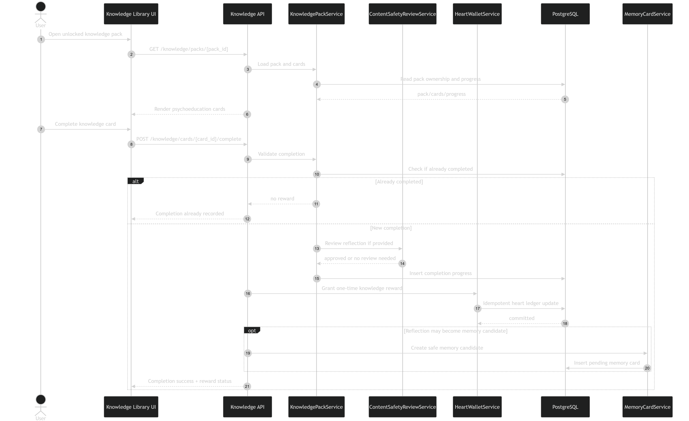

1. User mở một knowledge pack đã unlock.
2. Frontend gọi API để lấy cards và progress.
3. User đọc hoặc hoàn thành một knowledge card.
4. Backend kiểm tra card đã completed trước đó chưa.
5. Nếu đã completed, không cấp reward lần nữa.
6. Nếu là completion mới, backend validate progress.
7. Nếu có reflection, `ContentSafetyReviewService` kiểm tra nội dung.
8. Completion được lưu vào PostgreSQL.
9. `HeartWalletService` cấp reward một lần bằng idempotency key.
10. Nếu reflection có giá trị và an toàn, hệ thống có thể tạo memory candidate.
11. Frontend nhận completion success và reward status.
12. UI cập nhật progress và Heart balance.

---

## 13. End-to-End Release Flow — Chat to Retention Loop

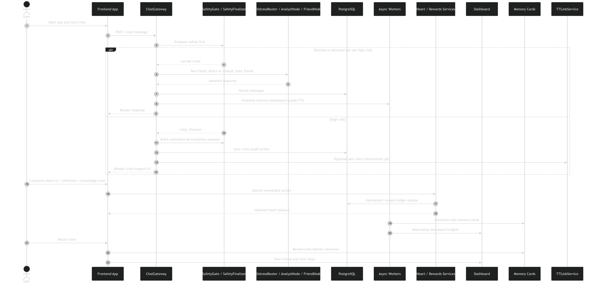

1. User mở app và bắt đầu chat.
2. Frontend gửi message đến `ChatGateway`.
3. `SafetyGate` luôn kiểm tra trước normal orchestration.
4. Nếu normal/elevated nhưng không high-risk, hệ thống chạy `DistressRouter`, tùy route có thể gọi **Internal Analyst Agent** (`AnalystNode`), rồi `PersonaRouter` và **Serene Conversation Agent** (`FriendNode`).
5. Nếu high-risk, hệ thống chuyển sang **Safety Agent** (`SafetyFinalizer`) và bypass luồng analyst/conversation bình thường.
6. Backend lưu message, safety metadata và các sync writes bắt buộc.
7. Async workers xử lý memory, graph sync, dashboard, reward signals hoặc TTS.
8. User hoàn thành check-in, reflection hoặc knowledge card để nhận Heart.
9. Reward service cập nhật ledger và balance bằng idempotent transaction.
10. Memory Cards được tạo sau session và chờ user review/control.
11. Dashboard materializes trend, trigger, coping và next-step insight.
12. User quay lại app để xem memory, dashboard, persona progression hoặc tiếp tục chat.
13. Toàn bộ loop giữ nguyên nguyên tắc: support trước, safety trên hết, insight không diagnosis, progression không khóa hỗ trợ thiết yếu.
