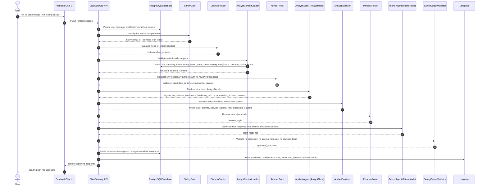
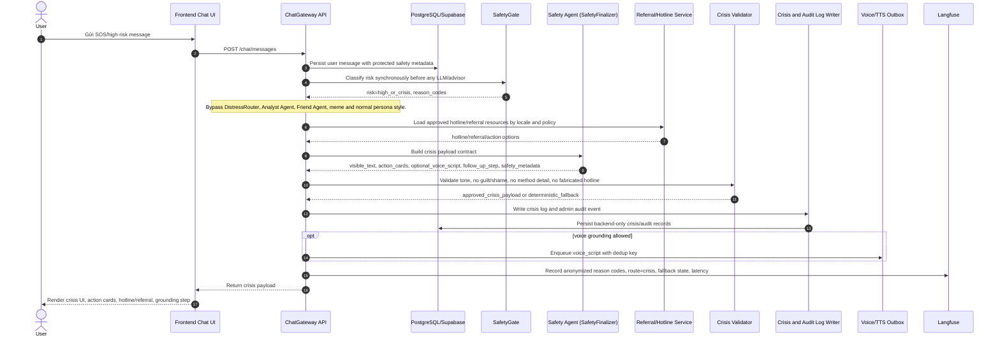
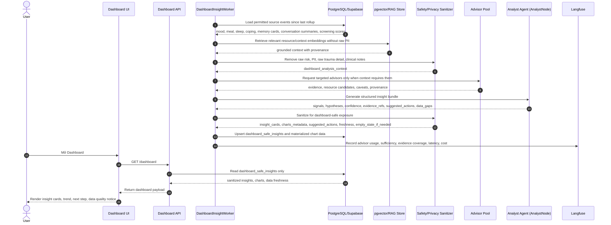
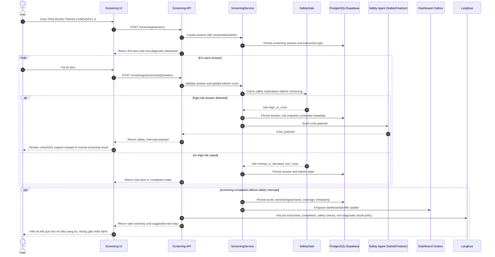
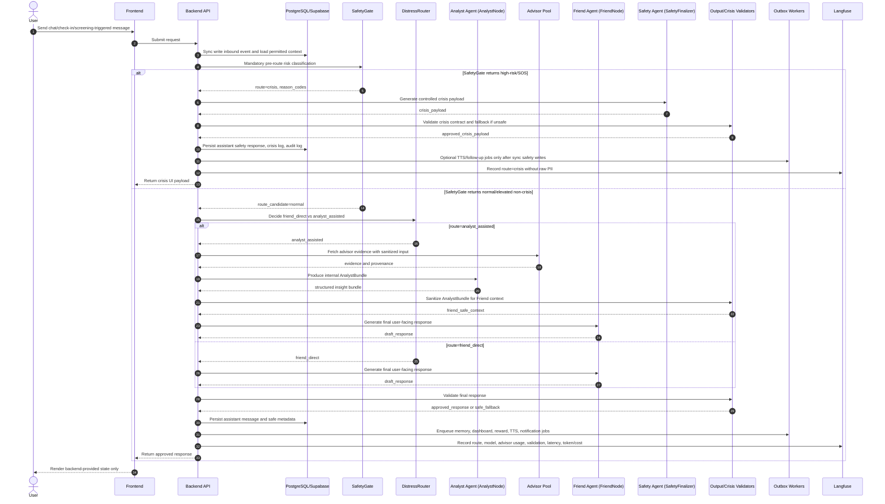

# Sequence Diagrams - Serene.AI Runtime

## Context

Tài liệu này là bộ sequence diagram canonical cho các luồng agent chính của Serene.AI, được cập nhật theo `docs/PRD.md` phiên bản 7.2. Mục tiêu không phải là liệt kê mọi tương tác phụ trong sản phẩm, mà là mô tả chính xác các đường đi quyết định giữa **Friend Agent**, **Analyst Agent** và **Safety Agent** trong những workflow có rủi ro sản phẩm, an toàn và vận hành cao nhất.

Các sơ đồ dùng Mermaid để có thể render trực tiếp trong Markdown preview, GitHub, hoặc công cụ tài liệu nội bộ.

## Problem Statement Technical Deep-Dive

PRD xác định Serene.AI là một assistant duy nhất với ba vai trò runtime chính. Persona, reward, memory, dashboard, resource retrieval, TTS và notification là service/router/worker, không phải agent độc lập có danh tính riêng. Do đó, sequence diagram phải tránh hai sai lệch kiến trúc phổ biến: biến mọi service thành agent, hoặc cho phép Analyst/Safety viết trực tiếp ra UI ngoài contract được kiểm soát.

| Vai trò runtime | Mã triển khai tham chiếu | User-facing | Trách nhiệm kỹ thuật |
|---|---|---:|---|
| Friend Agent | `FriendNode` | Có | Tạo phản hồi hội thoại cuối cùng trong normal flow, áp dụng persona như style mode, dùng context đã được lọc an toàn. |
| Analyst Agent | `AnalystNode` | Không | Tạo `AnalystBundle` có cấu trúc từ dữ liệu được phép, evidence, confidence, caveat và action candidate. |
| Safety Agent | `SafetyFinalizer` | Có, qua payload kiểm soát | Xử lý high-risk/SOS, de-escalation, hotline/referral, crisis/audit log và crisis UI payload. |

Các invariant bắt buộc trong mọi sơ đồ:

1. `SafetyGate` chạy trước mọi LLM call hoặc advisor call.
2. High-risk/SOS bypass toàn bộ normal flow, bao gồm Analyst Agent và Friend Agent.
3. Analyst Agent không nói trực tiếp với user; mọi nội dung chat user-facing phải đi qua Friend Agent hoặc dashboard-safe sanitizer.
4. Advisor không tạo final response; advisor chỉ cung cấp evidence, candidate hoặc critique cho Analyst.
5. PostgreSQL/Supabase là source of truth; Redis, pgvector, RAG, outbox và worker chỉ là lớp hỗ trợ.
6. Frontend chỉ render state/payload từ backend; frontend không tự quyết định safety tier, crisis state, reward grant hoặc diagnosis-like interpretation.
7. Output sanitizer chặn diagnosis label, internal metadata leak, prompt-injection echo, unsafe medical advice và persona bypass.

## Strategic Recommendations

| # | Sơ đồ | Quyết định kiến trúc được khóa |
|---:|---|---:|
| 1 | Normal Chat - Friend Direct | Latency thấp, SafetyGate trước Friend, Analyst không bị gọi khi không cần. |
| 2 | Analyst-Assisted Chat | Analyst internal-only, Friend diễn đạt lại user-safe, advisor có provenance. |
| 3 | Crisis/SOS - Safety Agent | Safety bypass normal flow, crisis/audit log sync, UI nhận payload kiểm soát. |
| 4 | Dashboard Rollup Insight | Analyst tạo insight từ dữ liệu được phép, sanitizer bảo vệ dashboard khỏi raw risk/trauma/rationale. |
| 5 | Guided Screening With Safety Intercept | PHQ/GAD/DASS/MDQ/PCL là screening signal, không diagnosis; risk answer chuyển Safety. |
| 6 | End-to-End Agent Runtime | Toàn bộ vòng lặp routing, persistence, async worker, trace và degradation. |

---

## 1. Normal Chat - Friend Direct

Luồng này xử lý một turn chat thông thường khi không có dấu hiệu high-risk và không cần phân tích pattern sâu. Mục tiêu hệ thống là tối ưu latency, giữ giọng Serene nhất quán, đồng thời vẫn thực thi safety gate và output validation đầy đủ.

```mermaid
sequenceDiagram
    autonumber
    actor User as User
    participant UI as Frontend Chat UI
    participant API as ChatGateway API
    participant Store as PostgreSQL/Supabase
    participant Redis as Redis Cache
    participant Safety as SafetyGate
    participant Router as DistressRouter
    participant Persona as PersonaRouter
    participant Friend as Friend Agent (FriendNode)
    participant Validator as SafetyOutputValidator
    participant Outbox as Outbox Queue
    participant Trace as Langfuse

    User->>UI: Gửi message tiếng Việt
    UI->>API: POST /chat/messages
    API->>Store: Persist user message, request id, session id
    API->>Store: Load recent messages, consent, profile, safe memory refs
    API->>Redis: Load ephemeral session/cache if available
    API->>Safety: Classify risk before LLM/advisor
    Safety-->>API: risk=normal, reason_codes
    API->>Router: Decide route from intent, distress, context sufficiency
    Router-->>API: route=friend_direct
    API->>Persona: Resolve selected persona and safety fallback
    Persona-->>API: style_mode=dung_luong, dat_le, or hau_luong; strength
    API->>Friend: Generate user-facing response with safe context and persona style
    Friend-->>API: draft_response
    API->>Validator: Validate no diagnosis, unsafe advice, internal leak, persona drift
    Validator-->>API: approved_response
    API->>Store: Persist assistant message and safe metadata
    API->>Outbox: Enqueue memory/dashboard/TTS jobs as non-blocking side effects
    API->>Trace: Record route, safety decision, model, latency, token/cost, validator verdict
    API-->>UI: Stream/render approved_response
    UI-->>User: Hiển thị phản hồi của Serene
```


**Kiểm soát sản phẩm:** Friend Agent là agent duy nhất tạo final response trong normal chat direct. Persona chỉ là style mode và bị SafetyGate/PersonaRouter override khi distress tăng.

---

## 2. Analyst-Assisted Chat - Analyst Internal, Friend User-Facing

Luồng này áp dụng khi user hỏi về pattern, dashboard context còn thiếu diễn giải, hoặc router nhận thấy câu trả lời trực tiếp sẽ tạo insight nông. Analyst Agent tạo bundle nội bộ; Friend Agent diễn đạt lại thành phản hồi an toàn, tự nhiên, không chẩn đoán.




**Kiểm soát sản phẩm:** Analyst Agent không được phép trả lời trực tiếp trong chat. Nếu `AnalystBundle` chứa diagnosis term, raw risk indicator hoặc rationale nội bộ, `AnalystSanitizer` phải loại bỏ trước khi Friend Agent nhận context.

---

## 3. Crisis/SOS - Safety Agent Bypasses Normal Flow

Luồng này xử lý self-harm, imminent danger, severe distress hoặc SOS explicit. Đây là đường đi ưu tiên reliability hơn personalization; mọi style vui, meme, Analyst và normal Friend response đều bị bypass.




**Kiểm soát sản phẩm:** Safety Agent là agent user-facing duy nhất trong high-risk/SOS, nhưng chỉ thông qua payload kiểm soát. Crisis log/audit log là sync write bắt buộc; TTS là async và không được block phản hồi text.

---

## 4. Dashboard Rollup Insight - Analyst to Dashboard-Safe Layer

Luồng này chạy theo worker hoặc refresh dashboard. Analyst Agent tạo insight có evidence và confidence, nhưng dashboard chỉ được đọc dữ liệu đã sanitize; raw trauma detail, clinical note, risk inference và analyst rationale không được expose.




**Kiểm soát sản phẩm:** Dashboard không được bịa insight khi thiếu dữ liệu. Khi evidence coverage thấp, worker phải materialize empty state hoặc data quality notice thay vì tạo kết luận giả.

---

## 5. Guided Screening With Safety Intercept

Luồng này bao phủ PHQ-9, GAD-7, DASS-21, MDQ và PCL-5. Các công cụ này chỉ là screening signal, không phải diagnosis; câu trả lời high-risk trong quá trình làm bài phải chuyển ngay sang Safety flow.




**Kiểm soát sản phẩm:** MDQ/PCL-5 không được hiển thị như nhãn bipolar/PTSD; PCL-5 không expose raw trauma detail lên dashboard; điểm cao phải khuyến nghị tìm chuyên gia theo ngôn ngữ không chẩn đoán.

---

## 6. End-to-End Agent Runtime

Sơ đồ này tổng hợp quyết định routing chính cho một chat turn, bao gồm normal direct, analyst-assisted và crisis. Đây là bản tham chiếu nên dùng khi review code orchestration hoặc viết integration test.




**Kiểm soát sản phẩm:** Frontend không tự suy luận route, safety tier hoặc crisis state. Mọi quyết định sản phẩm nhạy cảm nằm ở backend và được trace bằng Langfuse với dữ liệu đã ẩn danh.

---

## Verification Checklist

| Gate | Điều kiện đạt |
|---|---|
| Safety-first | Mọi sơ đồ có `SafetyGate` trước LLM/advisor hoặc safety intercept trong screening. |
| Friend boundary | Friend Agent chỉ nhận context an toàn và là final writer trong normal chat. |
| Analyst boundary | Analyst Agent không có đường trả lời trực tiếp tới UI/User. |
| Safety boundary | High-risk/SOS bypass Router, Analyst và Friend; Safety Agent trả payload kiểm soát. |
| Data architecture | PostgreSQL/Supabase là source of truth; outbox/worker là async side effect. |
| Dashboard privacy | Dashboard chỉ đọc `dashboard_safe_insights`, không đọc raw risk, trauma detail hoặc analyst rationale. |
| Non-diagnosis | Screening và insight đều dùng ngôn ngữ screening signal, caveat và suggested action. |
| Observability | Các luồng agentic đều ghi Langfuse trace với route, reason code, model/cost/latency và validator verdict. |
