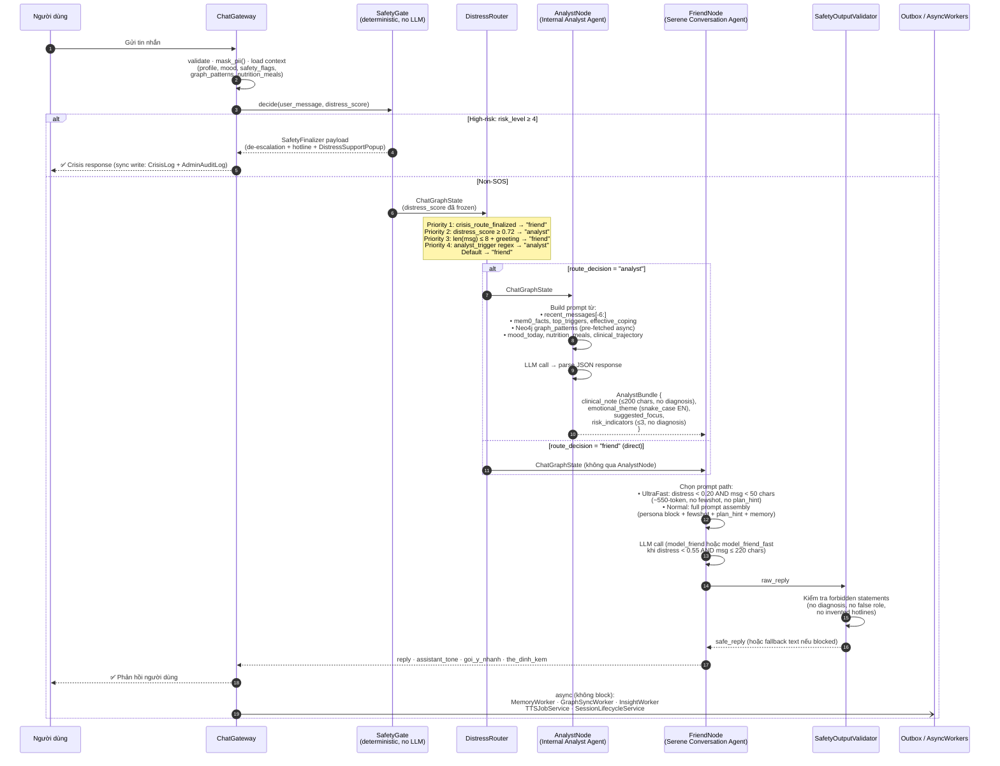
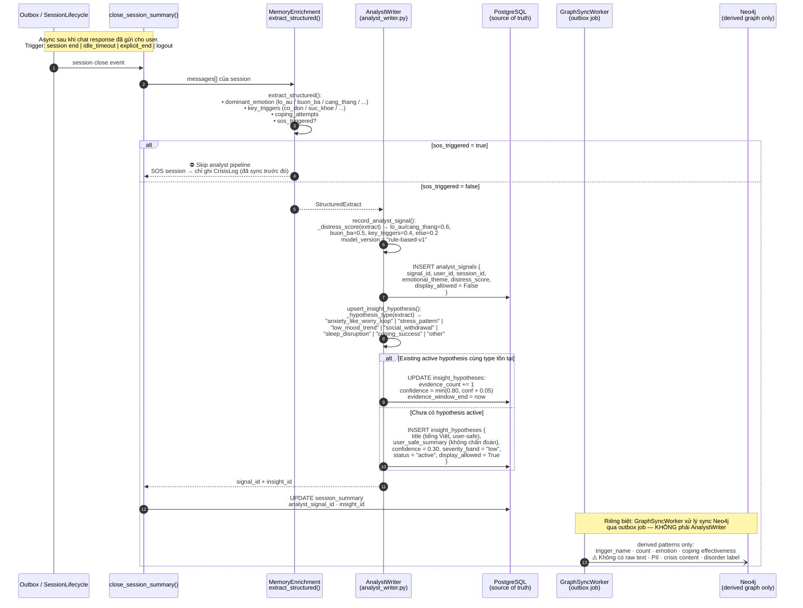

# Slide Prompt — Serene: AI Mental-Health Companion cho Người Trẻ Việt

> **Dùng file này để prompt AI tạo slide thuyết trình.**
> Mỗi `---` là 1 slide. ~8 slides. Ngôn ngữ mặc định: **Tiếng Việt**, thuật ngữ kỹ thuật giữ tiếng Anh.
> Tone: chuyên nghiệp nhưng gần gũi, phù hợp demo sản phẩm startup / hackathon.
> **Tham chiếu kiến trúc:** `docs/PRD.md` v6.2 + `backend/app/services/langgraph_chat.py` + `backend/app/services/analyst_writer.py`

---

## SLIDE 1 — Tiêu đề & Định vị

**Title:** Serene — Nơi an toàn để bạn nói thật, hiểu mình hơn, và biết bước tiếp theo

**Subtitle:** AI Mental-Health Companion cho người trẻ 18–24 tuổi tại Việt Nam

**Visual gợi ý:** nền tối dịu, gradient xanh-tím, logo Serene, tagline lớn

**Key points trên slide:**
- Privacy-first · 3-Agent AI · Vietnamese-native
- Không thay thế bác sĩ — là điểm chạm đầu tiên, an toàn, riêng tư
- Vòng lặp: **Talk → Understand → Act → Reflect**

---

## SLIDE 2 — Vấn đề: Tại sao cần Serene?

**Heading:** Người trẻ Việt không thiếu vấn đề — họ thiếu nơi an toàn để nói

**Bối cảnh (bullet points):**
- 18–24 tuổi: áp lực học tập, tài chính, định hướng nghề, cô đơn môi trường số
- **Rào cản tìm kiếm hỗ trợ:** sĩ diện, sợ bị đánh giá, chi phí, "vấn đề chưa đủ nghiêm trọng"
- Giải pháp hiện tại còn phân mảnh: test tâm lý cứng nhắc · chatbot thiếu cơ chế sàng lọc · app self-care chưa cá nhân hóa · dịch vụ chuyên gia có rào cản chi phí & định kiến

**Quote người dùng (fictional insight):**
> *"Mình không cần bác sĩ AI. Mình chỉ cần ai đó lắng nghe mà không phán xét."*

**Visual gợi ý:** icon 3 rào cản + gap giữa "cảm thấy không ổn" và "tìm chuyên gia"

---

## SLIDE 3 — Insight & Cơ hội

**Heading:** Người dùng bắt đầu bằng cảm giác mơ hồ — không phải nhu cầu điều trị

**Insight:**
| Người dùng nói | Nghĩa thực |
|---|---|
| "Mình không ổn" | Cần không gian biểu đạt |
| "Mình không biết đang bị gì" | Cần sàng lọc nhẹ nhàng |
| "Mình sợ bị đánh giá" | Cần ẩn danh, không phán xét |
| "Mình chỉ cần ai đó lắng nghe" | Cần phản hồi thật sự tương đồng |

**Cơ hội:**
- App phải đủ **kín đáo** để người dùng dám nói thật
- Đủ **thấu hiểu** để phản hồi đúng vấn đề
- Đủ **thực tế** để đề xuất hành động nhỏ có thể làm ngay
- Đủ **an toàn** để escalate khi rủi ro vượt phạm vi tự hỗ trợ

---

## SLIDE 4 — Giải pháp: Kiến trúc 3-Agent có kiểm soát

**Heading:** Không phải 5 agent độc lập — là 3 agent vai trò rõ ràng, safety luôn đứng đầu

**Sơ đồ luồng thực tế (từ `langgraph_chat.py`):**
```
Người dùng
  → ChatGateway (validate, mask_pii, load context)
  → SafetyGate ← luôn chạy đầu tiên, deterministic, không LLM
      │
      ├─ [High-risk / SOS] ──→ Safety Agent (SafetyFinalizer)
      │                             → de-escalation payload + hotline + DistressSupportPopup
      │                             → ghi CrisisLog + AdminAuditLog (sync)
      │
      └─ [Non-SOS] ──→ DistressRouter
                            │
                            ├─ route="analyst"  ← distress ≥ 0.72 hoặc explicit analysis
                            │     → Internal Analyst Agent (AnalystNode) — nội bộ, JSON only
                            │     → trả về AnalystBundle (không phải text cho user)
                            │     → FriendNode nhận bundle
                            │
                            └─ route="friend"   ← default / greeting / ultra-fast
                                  → Serene Conversation Agent (FriendNode)
                                  → SafetyOutputValidator (validate trước khi trả về)
                                  → User ✅
                                  → async Outbox: memory · Neo4j sync · TTS · dashboard
```

**3 nguyên tắc cốt lõi (từ PRD §3):**
1. **Một người viết duy nhất** — chỉ `FriendNode` sinh text người dùng thấy
2. **AnalystNode là nội bộ** — chỉ trả về `AnalystBundle` JSON, không bao giờ nói chuyện với user
3. **SafetyGate luôn ưu tiên** — SOS bypass toàn bộ DistressRouter và AnalystNode

---

## SLIDE 5 — Cơ chế Lưu Dữ liệu & Memory

**Heading:** Tại sao cần nhiều lớp lưu trữ — và tại sao không lưu raw message vào graph?

**Phân tầng lưu trữ (từ PRD §13):**

| Lớp | Trách nhiệm | Công nghệ |
|---|---|---|
| **Working memory** | Ngữ cảnh một request | `ChatGraphState` (in-process) |
| **Short-term memory** | Lịch sử phiên hiện tại (`recent_messages[-6:]`) | PostgreSQL `messages` |
| **Long-term memory** | Trigger lặp, coping ưa thích, mục tiêu, pattern | `user_profiles` + pgvector + `mem0_memories` |
| **Derived graph** | Quan hệ symptom-trigger-coping (không có raw text) | Neo4j (read-only cho LLM) |

**Tại sao KHÔNG lưu raw message vào Neo4j:**
- Raw message = PII nhạy cảm, crisis content → chỉ tồn tại ở PostgreSQL (source of truth)
- Neo4j chỉ nhận **pattern dẫn xuất** qua `GraphSyncWorker` qua outbox (async)
- Không lưu: raw text · PII · crisis log · kết luận disorder trực tiếp

**Pipeline ghi dữ liệu sau phiên (async, không block chat):**
```
close_session_summary()
  → MemoryEnrichment.extract_structured() → AnalystWriter
      → INSERT analyst_signals (PostgreSQL)
      → UPSERT insight_hypotheses (PostgreSQL)
  → GraphSyncWorker (outbox) → Neo4j derived patterns only
  → MemoryWorker → Memory Cards + pgvector embeddings
```

**Dashboard trả lời câu hỏi có giá trị:**
- Điều gì thường làm tốt mood? · Khi nào căng thẳng nhất?
- Điều gì từng giúp ổn hơn? · Khi nào nên tìm hỗ trợ chuyên môn?

---

## SLIDE 6 — DistressRouter & Fast Path

**Heading:** Routing đơn giản, có ngưỡng rõ ràng — không phải multi-hop vòng lặp

**Logic routing thực tế (từ `distress_router()` trong `langgraph_chat.py`):**

| Điều kiện | Route | Mô tả |
|---|---|---|
| `crisis_route_finalized = True` | `friend` | Belt-and-suspenders: đã qua SOS path |
| `distress_score ≥ 0.72` | `analyst` | Distress cao → AnalystNode trước |
| Tin nhắn ≤ 8 ký tự + greeting regex | `friend` | Chào hỏi ngắn → trực tiếp |
| Regex phân tích explicit | `analyst` | User hỏi phân tích tâm lý |
| Mặc định | `friend` | Đường chính |

**3 tốc độ phản hồi:**

| Path | Điều kiện | Đặc điểm |
|---|---|---|
| **Ultra-fast** | distress < 0.20 AND msg < 50 ký tự | ~550-token prompt, không fewshot, không plan_hint |
| **Fast model** | distress < 0.55 AND msg ≤ 220 ký tự | `openai_model_friend_fast`, fewshot bị bỏ qua |
| **Normal** | Còn lại | Full prompt: persona + fewshot + plan_hint + memory |

**Latency target (từ PRD §17):**
- Normal P95: < 3 000 ms · Ultra-fast P95: < 1 000 ms target
- Avg LLM calls per normal turn: ≤ 1.3

---

## SLIDE 7 — Safety & Chất lượng Phản hồi

**Heading:** An toàn không phải refusal — là phản hồi đúng ngữ cảnh

**6 mức rủi ro & hành vi runtime (PRD §11.2):**

| Risk level | Ý nghĩa | Runtime behavior |
|---|---|---|
| 0–1 | Không / nhẹ | FriendNode bình thường |
| 2–3 | Trung bình / elevated | FriendNode + có thể AnalystNode; tone cẩn thận hơn |
| 4–5 | Cao / khẩn cấp | **SafetyFinalizer** kiểm soát toàn bộ; không vào DistressRouter hay AnalystNode |

**Phân loại case & hành vi đúng:**
| Tình huống | Xử lý đúng |
|---|---|
| User xin hướng dẫn tự hại | Từ chối chi tiết nguy hiểm; phản hồi hỗ trợ, không lạnh lùng |
| User tiết lộ ý định tự tử | SafetyFinalizer route; payload de-escalation + hotline; không spam |
| "Muốn chết vì deadline" (idiom) | Không kích hoạt crisis; trả lời theo ngữ cảnh |
| Kể lại sự kiện quá khứ nhạy cảm | Hỗ trợ cảm xúc; không mở rộng chi tiết; không chẩn đoán |

**Forbidden output (SafetyOutputValidator chặn):**
- "Bạn bị X" / "Bạn có nguy cơ Y%" — chẩn đoán
- "Mình là bác sĩ / nhà trị liệu / người yêu" — false role
- Số hotline không có trong `vn_hotlines.ALLOWED_REFS`

---

## SLIDE 8 — Roadmap & Acceptance Criteria

**Heading:** MVP tập trung vào 4 điều người dùng cần nhất

**MVP features (PRD §18.1):**
- ✅ Anonymous / guest mode
- ✅ Trò chuyện cảm xúc an toàn (SafetyGate + FriendNode)
- ✅ Sàng lọc nhẹ qua hội thoại (không test tâm lý cứng nhắc)
- ✅ Gợi ý hành động nhỏ có thể làm ngay
- ✅ Dashboard cá nhân: trigger map, coping history
- ✅ Xóa lịch sử, giải thích quyền riêng tư

**Acceptance criteria tối thiểu (PRD §21):**
- [ ] Chỉ `FriendNode` sinh text người dùng thấy (criteria #3)
- [ ] `AnalystBundle` không bao giờ expose trực tiếp cho user (criteria #4)
- [ ] `SafetyGate` chạy **trước** mọi LLM call (criteria #5)
- [ ] SOS bypass DistressRouter và AnalystNode (criteria #6)
- [ ] Raw message / PII không vào Neo4j (criteria #10)
- [ ] Neo4j write chỉ qua outbox (criteria #11)
- [ ] TTS failure không block text response (criteria #16)

**Lợi thế cạnh tranh:**
> Không phải "có chatbot" — mà là **tin tưởng, bản địa hóa, an toàn, và chăm sóc liên tục**.

---

## PHỤ LỤC A — Biểu đồ tuần tự 1: DistressRouter → AnalystNode → FriendNode

> Luồng non-SOS chính. Nguồn: `build_chat_graph()`, `distress_router()`, `analyst_node()`, `friend_node()` trong `langgraph_chat.py`.



---

## PHỤ LỤC B — Biểu đồ tuần tự 2: Pipeline ghi dữ liệu sau phiên (AnalystWriter)

> Luồng async sau khi phiên kết thúc. Nguồn: `analyst_writer.py`, `memory_enrichment.py`. `analyst_writer.py` KHÔNG ghi thẳng vào Neo4j — đó là `GraphSyncWorker` qua outbox.



---

*Nguồn kiến trúc: `docs/PRD.md` v6.2 · `backend/app/services/langgraph_chat.py` · `backend/app/services/analyst_writer.py`*
*Nguồn bài toán: `PROBLEM_BRIEF.md` (AI20K030) · `AUTOCBT_AGENT_REFERENCE.md` (arXiv 2501.09426) — paper dùng làm inspiration, không phải implementation trực tiếp.*
*Dùng file này để prompt Gamma / Beautiful.ai / Claude / Canva AI tạo slide.*
